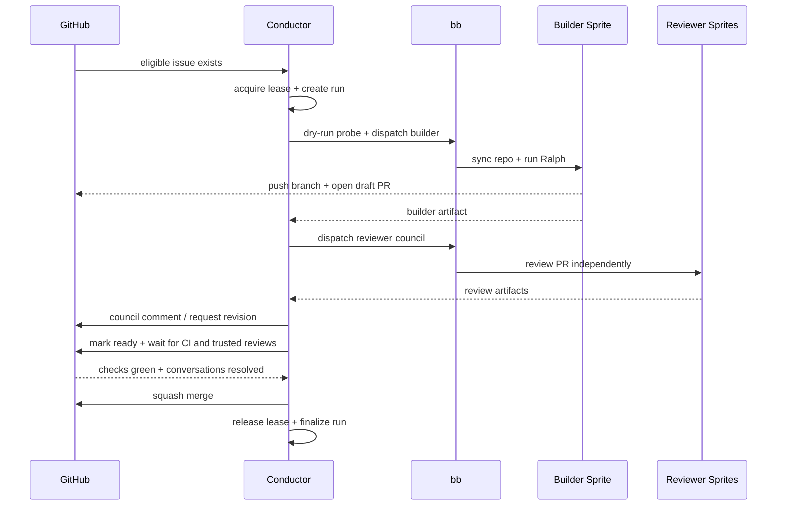

# CODEBASE_MAP

Current Bitterblossom is a **conductor-first software factory**:

- `conductor/`: Elixir/OTP orchestrator — the workflow brain.
- `cmd/bb/`: thin Go transport, the operator edge for talking to sprites.
- `scripts/ralph.sh`: remote execution loop that runs work on a sprite.
- `base/skills/`: skill library provisioned onto every managed sprite.

If you are trying to understand how the repo works today, start from those four entrypoints.

The Python conductor (`scripts/conductor.py`) is deprecated as of [ADR-004](adr/004-elixir-conductor-architecture.md). It remains as reference; new features land in the Elixir conductor.

## Authoritative Entry Points

| Path | Role |
|---|---|
| [`conductor/lib/conductor/`](../conductor/lib/conductor/) | Elixir/OTP orchestrator: intake, leasing, builder/reviewer dispatch, CI wait, governance, merge, run state |
| [`cmd/bb/main.go`](../cmd/bb/main.go) + [`cmd/bb/*.go`](../cmd/bb/) | Sprite auth, setup, repo sync, prompt upload, PTY execution, logs, status, kill |
| [`scripts/ralph.sh`](../scripts/ralph.sh) | On-sprite execution loop, heartbeat output, signal-file protocol, bounded agent iterations |
| [`base/skills/`](../base/skills/) | Agent skill modules provisioned via `bb setup`; advisory guidance for each workflow phase |

## Trace Bullet

## Subsystem Map

### Control Plane

- [`conductor/lib/conductor/`](../conductor/lib/conductor/) *(primary — Elixir/OTP)*
  - `orchestrator.ex` — polling loop, issue selection, run dispatch
  - `run_server.ex` — per-run GenServer state machine
  - `store.ex` — SQLite persistence (runs, leases, events)
  - `github.ex` — GitHub operations via `gh` CLI
  - `sprite.ex` — sprite dispatch via `bb` CLI
  - `workspace.ex` — worktree lifecycle
  - See [ADR-004](adr/004-elixir-conductor-architecture.md) for full design
- [`scripts/conductor.py`](../scripts/conductor.py) *(deprecated — Python reference)*
  - governance loop, review handling, merge logic; no new features
- [`conductor/test/`](../conductor/test/)
  - Elixir ExUnit test suite
- [`docs/CONDUCTOR.md`](CONDUCTOR.md)
  - operator-facing contract for the conductor loop
- [`docs/architecture/conductor.md`](architecture/conductor.md)
  - fast architecture drill-down for this module

### Transport Edge

- [`cmd/bb/main.go`](../cmd/bb/main.go)
  - root Cobra command, auth resolution, top-level command registration
- [`cmd/bb/setup.go`](../cmd/bb/setup.go)
  - uploads `base/`, repo bootstrap/repair, workspace metadata
  - see also: [`cmd/bb/sprite_workspace.go`](../cmd/bb/sprite_workspace.go), [`cmd/bb/workspace_metadata.go`](../cmd/bb/workspace_metadata.go)
- [`cmd/bb/dispatch.go`](../cmd/bb/dispatch.go)
  - probe, stale-process cleanup, repo sync, prompt upload, Ralph exec, result verification
- [`cmd/bb/status.go`](../cmd/bb/status.go)
  - sprite truth and operator status surface
- [`cmd/bb/logs.go`](../cmd/bb/logs.go)
  - remote `ralph.log` streaming
- [`cmd/bb/kill.go`](../cmd/bb/kill.go)
  - recovery path for stuck Ralph/agent processes
- [`cmd/bb/offrails.go`](../cmd/bb/offrails.go), [`cmd/bb/stream_json.go`](../cmd/bb/stream_json.go)
  - silence/error-loop detection and stream-json parsing
- [`docs/CLI-REFERENCE.md`](CLI-REFERENCE.md)
  - operator reference for the current `bb` command surface
- [`docs/architecture/bb-cli.md`](architecture/bb-cli.md)
  - architecture drill-down for transport responsibilities

### Runtime + Prompt Contracts

- [`scripts/ralph.sh`](../scripts/ralph.sh)
  - bounded remote agent loop and signal-file exit contract
- [`scripts/prompts/`](../scripts/prompts/)
  - builder/reviewer prompt templates and artifact expectations
- [`docs/COMPLETION-PROTOCOL.md`](COMPLETION-PROTOCOL.md)
  - signal files, artifact expectations, and completion semantics

### Skill System

- [`base/skills/`](../base/skills/)
  - versioned skill library provisioned via `bb setup`
  - `bitterblossom-dispatch/` — probe + dispatch + monitoring workflow
  - `bitterblossom-monitoring/` — stuck-sprite recovery and diagnostics
  - `autopilot/`, `shape/`, `build/`, `pr/`, `pr-walkthrough/`, `debug/`, `pr-fix/`, `pr-polish/` — vendored phase workflow skills
  - `external-integration/`, `git-mastery/`, `naming-conventions/`, `testing-philosophy/` — craft discipline skills
- [`docs/architecture/skills.md`](architecture/skills.md)
  - skill inventory, provisioning pipeline, and WORKFLOW.md contract

### Base Runtime Surface

- [`base/settings.json`](../base/settings.json)
  - canonical runtime configuration pushed to sprites
- [`base/hooks/`](../base/hooks/)
  - destructive-command guard and fast-feedback hooks
- [`base/CLAUDE.md`](../base/CLAUDE.md)
  - shared operating instructions for dispatched agents

### Personas + Factory Inputs

- [`sprites/*.md`](../sprites/)
  - per-sprite personas / specializations
- [`compositions/`](../compositions/)
  - experimental team hypotheses and historical input, not current conductor scheduler truth
- [`project.md`](../project.md)
  - current repo vision, glossary, active focus, and quality bar
- [`AGENTS.md`](../AGENTS.md)
  - coding-agent context and working conventions for this repo

### History / Reports / Archive

- [`observations/`](../observations/)
  - learning journal and experiments
- [`reports/`](../reports/)
  - generated reports and snapshots
- [`docs/archive/`](archive/)
  - historical docs; not the source of truth for current architecture

## Durable State and Contracts

### Local control-plane truth

- `.bb/conductor.db`
- `.bb/events.jsonl`

These are the machine-facing source of truth for:

- run phase/status
- lease ownership and heartbeat expiry
- reviewer verdicts and governance events
- append-only event history

### Remote per-run artifacts

- `${WORKSPACE}/.bb/conductor/<run_id>/builder-result.json`
- `${WORKSPACE}/.bb/conductor/<run_id>/review-<sprite>.json`
- `${WORKSPACE}/.bb/workspace.json`
- signal files such as `TASK_COMPLETE`, `TASK_COMPLETE.md`, `BLOCKED.md`

GitHub remains the human-facing conversation and merge surface, but these artifacts are how the machine proves what happened.

## Current Reality vs Roadmap

### True today

- Bitterblossom is conductor-first, not CLI-first.
- `bb` is the current operator/transport surface.
- Builder and reviewer runs are tracked with durable run and lease state.
- Reviewer readiness includes probe + forced setup repair before a run proceeds.
- Governance is explicit: council review, CI, conversations, trusted external reviews, then merge.

### Not true yet

- Per-run git worktree isolation is not fully landed yet.
- Composition files are not the authoritative scheduler input for the conductor loop.
- Routing is not a fully semantic/LLM-driven planner; current selection is still deterministic.
- `base/skills/` is not the source of truth for the live CLI command surface.

## Notable Absences

These absences matter because old docs still sometimes imply otherwise:

- There is no current `internal/` package tree.
- There is no current `pkg/` package tree.
- There is no separate legacy orchestration stack outside the conductor + `bb` split.
- The primary operator-facing `bb` surface is small: setup, dispatch, status, logs, kill, version.

## Read Next

1. [`docs/architecture/README.md`](architecture/README.md)
2. [`docs/architecture/conductor.md`](architecture/conductor.md)
3. [`docs/architecture/bb-cli.md`](architecture/bb-cli.md)
4. [`docs/architecture/skills.md`](architecture/skills.md)
5. [`docs/CONDUCTOR.md`](CONDUCTOR.md)
6. [`docs/CLI-REFERENCE.md`](CLI-REFERENCE.md)
7. [`AGENTS.md`](../AGENTS.md)
8. [`project.md`](../project.md)
9. [`docs/context/INDEX.md`](context/INDEX.md)
