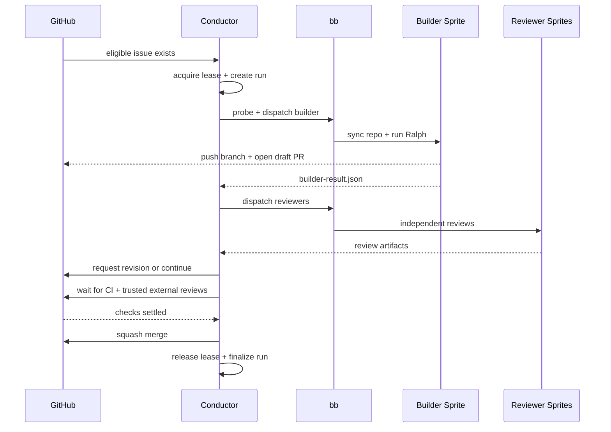

# CODEBASE_MAP

Current Bitterblossom is a **conductor-first software factory**:

- `scripts/conductor.py` is the workflow brain and durable control plane.
- `cmd/bb/` is the thin transport/operator edge for talking to sprites.
- `scripts/ralph.sh` is the remote execution loop that actually runs work on a sprite.

If you are trying to understand how the repo works today, start from those three entrypoints.

## Authoritative Entry Points

| Path | Role |
|---|---|
| `scripts/conductor.py` | Intake, leasing, builder/reviewer orchestration, CI wait, review-thread handling, trusted external review settling, merge, durable run state |
| `cmd/bb/main.go` + `cmd/bb/*.go` | Sprite auth, setup, repo sync, prompt upload, PTY execution, logs, status, kill |
| `scripts/ralph.sh` | On-sprite execution loop, heartbeat output, signal-file protocol, bounded agent iterations |

## Trace Bullet

## Subsystem Map

### Control Plane

- `scripts/conductor.py`
  - SQLite-backed run ledger
  - lease acquisition/reclaim/release
  - issue intake and prioritization
  - builder dispatch and artifact verification
  - reviewer council dispatch
  - governance loop: CI, review threads, trusted external reviews, quiet-window settling
  - merge / reconcile / operator inspection surfaces
- `scripts/test_conductor.py`
  - acceptance proof and governance regression coverage
- `docs/CONDUCTOR.md`
  - operator-facing contract for the conductor loop
- `docs/architecture/conductor.md`
  - fast architecture drill-down for this module

### Transport Edge

- `cmd/bb/main.go`
  - root Cobra command, auth resolution, top-level command registration
- `cmd/bb/setup.go`
  - uploads `base/`, repo bootstrap/repair, workspace metadata
- `cmd/bb/dispatch.go`
  - probe, stale-process cleanup, repo sync, prompt upload, Ralph exec, result verification
- `cmd/bb/status.go`
  - sprite truth and operator status surface
- `cmd/bb/logs.go`
  - remote `ralph.log` streaming
- `cmd/bb/kill.go`
  - recovery path for stuck Ralph/agent processes
- `cmd/bb/offrails.go`, `cmd/bb/stream_json.go`
  - silence/error-loop detection and stream-json parsing
- `docs/CLI-REFERENCE.md`
  - operator reference for the current `bb` command surface
- `docs/architecture/bb-cli.md`
  - architecture drill-down for transport responsibilities

### Runtime + Prompt Contracts

- `scripts/ralph.sh`
  - bounded remote agent loop and signal-file exit contract
- `scripts/prompts/`
  - builder/reviewer prompt templates and artifact expectations
- `docs/COMPLETION-PROTOCOL.md`
  - signal files, artifact expectations, and completion semantics

### Base Runtime Surface

- `base/settings.json`
  - canonical runtime configuration pushed to sprites
- `base/hooks/`
  - destructive-command guard and fast-feedback hooks
- `base/CLAUDE.md`
  - shared operating instructions for dispatched agents
- `base/skills/`
  - reusable guidance shipped onto sprites; useful, but not authoritative for current CLI flags

### Personas + Factory Inputs

- `sprites/*.md`
  - per-sprite personas / specializations
- `compositions/`
  - experimental team hypotheses and historical input, not current conductor scheduler truth
- `project.md`
  - current repo vision, glossary, active focus, and quality bar
- `AGENTS.md`
  - coding-agent context and working conventions for this repo

### History / Reports / Archive

- `observations/`
  - learning journal and experiments
- `reports/`
  - generated reports and snapshots
- `docs/archive/`
  - historical docs; not the source of truth for current architecture

## Durable State and Contracts

### Local control-plane truth

- `.bb/conductor.db`
- `.bb/events.jsonl`

These are the machine-facing source of truth for:

- run phase/status
- lease ownership and heartbeat expiry
- reviewer verdicts and governance events
- append-only event history

### Remote per-run artifacts

- `${WORKSPACE}/.bb/conductor/<run_id>/builder-result.json`
- `${WORKSPACE}/.bb/conductor/<run_id>/review-<sprite>.json`
- `${WORKSPACE}/.bb/workspace.json`
- signal files such as `TASK_COMPLETE`, `TASK_COMPLETE.md`, `BLOCKED.md`

GitHub remains the human-facing conversation and merge surface, but these artifacts are how the machine proves what happened.

## Current Reality vs Roadmap

### True today

- Bitterblossom is conductor-first, not CLI-first.
- `bb` is the current operator/transport surface.
- Builder and reviewer runs are tracked with durable run and lease state.
- Reviewer readiness includes probe + forced setup repair before a run proceeds.
- Governance is explicit: council review, CI, conversations, trusted external reviews, then merge.

### Not true yet

- Per-run git worktree isolation is not fully landed yet.
- Composition files are not the authoritative scheduler input for the conductor loop.
- Routing is not a fully semantic/LLM-driven planner; current selection is still deterministic.
- `base/skills/` is not the source of truth for the live CLI command surface.

## Notable Absences

These absences matter because old docs still sometimes imply otherwise:

- There is no current `internal/` package tree.
- There is no current `pkg/` package tree.
- There is no separate legacy orchestration stack outside the conductor + `bb` split.
- The active `bb` surface is small: setup, dispatch, status, logs, kill, version.

## Read Next

1. `docs/context/INDEX.md`
2. `docs/architecture/README.md`
3. `docs/CONDUCTOR.md`
4. `docs/CLI-REFERENCE.md`
5. `AGENTS.md`
6. `project.md`
