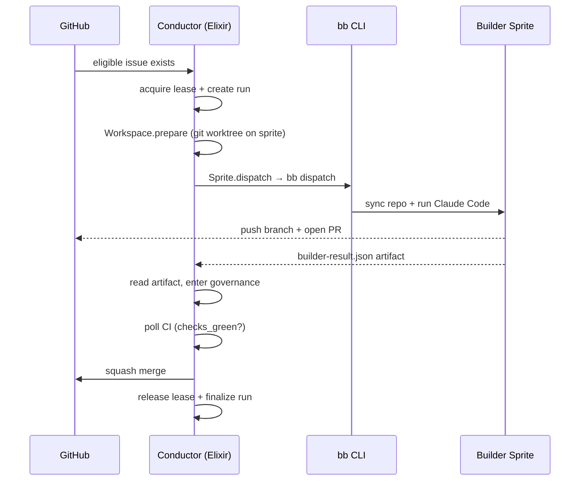

# CODEBASE_MAP

Current Bitterblossom is a **conductor-first software factory**:

- `conductor/` (Elixir/OTP) is the workflow brain and durable control plane.
- `cmd/bb/` (Go) is the thin transport/operator edge for talking to sprites. Transitional — being absorbed into Elixir per #621.
- `scripts/ralph.sh` is the remote execution loop that runs Claude Code on a sprite.

Start from those three entrypoints to understand how the repo works today.

## Authoritative Entry Points

| Path | Role |
|---|---|
| [`conductor/lib/conductor/`](../conductor/lib/conductor/) | Elixir/OTP control plane: orchestrator, per-run GenServer, store, GitHub, sprite, workspace |
| [`cmd/bb/main.go`](../cmd/bb/main.go) + [`cmd/bb/*.go`](../cmd/bb/) | Go transport: sprite auth, setup, repo sync, prompt upload, PTY exec, logs, status, kill |
| [`scripts/ralph.sh`](../scripts/ralph.sh) | On-sprite execution loop, heartbeat output, signal-file protocol |

## Trace Bullet

## Subsystem Map

### Control Plane (Elixir)

- [`conductor/lib/conductor/orchestrator.ex`](../conductor/lib/conductor/orchestrator.ex)
  - polling loop, issue selection, run dispatch, round-robin worker selection
- [`conductor/lib/conductor/run_server.ex`](../conductor/lib/conductor/run_server.ex)
  - per-run GenServer: lease → workspace → build → govern → merge/fail/block
- [`conductor/lib/conductor/store.ex`](../conductor/lib/conductor/store.ex)
  - SQLite persistence: runs, leases, events
- [`conductor/lib/conductor/github.ex`](../conductor/lib/conductor/github.ex)
  - GitHub intent via `gh` CLI: issues, checks, merge, comments
- [`conductor/lib/conductor/sprite.ex`](../conductor/lib/conductor/sprite.ex)
  - sprite exec, dispatch (Claude Code), artifact fetch
- [`conductor/lib/conductor/workspace.ex`](../conductor/lib/conductor/workspace.ex)
  - git worktree prepare/cleanup on sprite filesystem
- [`conductor/lib/conductor/prompt.ex`](../conductor/lib/conductor/prompt.ex)
  - builder prompt construction with issue + repo context
- [`docs/architecture/conductor.md`](architecture/conductor.md)
  - architecture drill-down: OTP tree, state machine, key interfaces

### Transport Edge (Go — transitional)

- [`cmd/bb/main.go`](../cmd/bb/main.go)
  - root Cobra command, auth resolution, top-level command registration
- [`cmd/bb/setup.go`](../cmd/bb/setup.go)
  - uploads `base/`, repo bootstrap/repair, workspace metadata
- [`cmd/bb/dispatch.go`](../cmd/bb/dispatch.go)
  - probe, stale-process cleanup, repo sync, prompt upload, Ralph exec, verification
- [`cmd/bb/status.go`](../cmd/bb/status.go)
  - sprite truth and operator status surface
- [`cmd/bb/logs.go`](../cmd/bb/logs.go)
  - remote `ralph.log` streaming
- [`cmd/bb/kill.go`](../cmd/bb/kill.go)
  - recovery path for stuck Ralph/agent processes
- [`docs/CLI-REFERENCE.md`](CLI-REFERENCE.md)
  - operator reference for the current `bb` command surface
- [`docs/architecture/bb-cli.md`](architecture/bb-cli.md)
  - architecture drill-down for transport responsibilities

### Runtime + Prompt Contracts

- [`scripts/ralph.sh`](../scripts/ralph.sh)
  - bounded remote agent loop and signal-file exit contract
- [`scripts/builder-prompt-template.md`](../scripts/builder-prompt-template.md)
  - builder prompt template (rendered by `conductor/prompt.ex`)
- [`docs/COMPLETION-PROTOCOL.md`](COMPLETION-PROTOCOL.md)
  - signal files, artifact expectations, and completion semantics

### Base Runtime Surface

- [`base/settings.json`](../base/settings.json)
  - canonical runtime configuration pushed to sprites
- [`base/hooks/`](../base/hooks/)
  - destructive-command guard and fast-feedback hooks
- [`base/CLAUDE.md`](../base/CLAUDE.md)
  - shared operating instructions for dispatched agents
- [`base/skills/`](../base/skills/)
  - reusable guidance shipped onto sprites at `bb setup` time
- [`docs/architecture/skills.md`](architecture/skills.md)
  - skills drill-down: layers, provisioning contract, phase mapping

### Personas + Factory Inputs

- [`sprites/*.md`](../sprites/)
  - per-sprite personas / specializations
- [`WORKFLOW.md`](../WORKFLOW.md)
  - agent-facing runtime contract: phases, workers, required skills, merge policy
- [`AGENTS.md`](../AGENTS.md)
  - coding-agent context and working conventions for this repo

### History / Reports / Archive

- [`observations/`](../observations/)
  - learning journal and experiments
- [`docs/archive/`](archive/)
  - historical docs; not the source of truth for current architecture

## Durable State and Contracts

### Control-plane truth (on conductor host)

- `.bb/conductor.db` — SQLite: runs, leases, events

### Remote per-run artifacts (on sprite)

- `${WORKSPACE}/.bb/conductor/<run_id>/builder-result.json`
- `${WORKSPACE}/.bb/workspace.json`
- signal files: `TASK_COMPLETE`, `BLOCKED.md`

GitHub is the human-facing conversation and merge surface. SQLite is how the machine proves what happened.

## Current Reality vs Roadmap

### True today

- Bitterblossom is Elixir-conductor-first, not CLI-first.
- `bb` is the current transport edge but is shrinking.
- Each run gets an isolated git worktree on the builder sprite.
- Governance is explicit: builder artifact → CI polling → squash merge.

### Not yet true

- Full `bb` surface absorption into Elixir (tracked in #621).
- Semantic/LLM-driven issue routing; current selection is still deterministic.
- Reviewer council dispatch (Python conductor had this; Elixir rewrite has not re-added it yet).

## Read Next

1. [`docs/architecture/README.md`](architecture/README.md)
2. [`docs/architecture/conductor.md`](architecture/conductor.md)
3. [`docs/CLI-REFERENCE.md`](CLI-REFERENCE.md)
4. [`AGENTS.md`](../AGENTS.md)
5. [`WORKFLOW.md`](../WORKFLOW.md)
