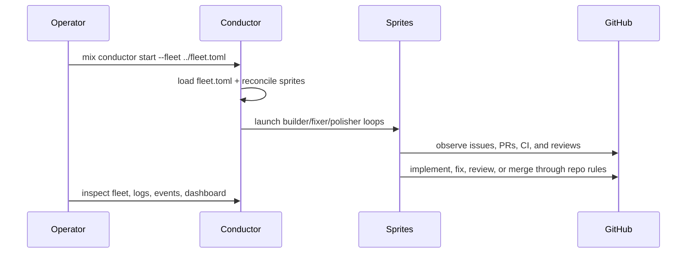

# CODEBASE_MAP

Current Bitterblossom is a conductor-first system.

## Authoritative Entry Points

| Path | Role |
|---|---|
| [`conductor/lib/conductor/`](../conductor/lib/conductor/) | Elixir/OTP control plane: fleet launch, sprite dispatch, logs, dashboard, health, and operator CLI support |
| [`base/`](../base/) | Shared hooks, settings, and uploaded skill/runtime assets |
| [`sprites/`](../sprites/) | Repo-owned agent personas and autonomous loop instructions |
| [`fleet.toml`](../fleet.toml) | Declared fleet membership, repo assignment, and persona configuration |
| [`WORKFLOW.md`](../WORKFLOW.md) | Repo-owned runtime contract |

Historical note: [`cmd/bb/`](../cmd/bb/) remains in-tree as legacy material pending [#703](https://github.com/misty-step/bitterblossom/issues/703). It is not the supported operator surface.

## High-Level Flow

## Subsystem Map

### Control Plane

- [`conductor/lib/conductor/application.ex`](../conductor/lib/conductor/application.ex)
  - boots the app, reconciles the fleet, and launches loop restarts
- [`conductor/lib/conductor/cli.ex`](../conductor/lib/conductor/cli.ex)
  - operator command surface behind `mix conductor ...`
- [`conductor/lib/conductor/fleet/`](../conductor/lib/conductor/fleet/)
  - fleet loading, reconciliation, and health monitoring
- [`conductor/lib/conductor/sprite.ex`](../conductor/lib/conductor/sprite.ex)
  - sprite exec, logs, kill, and provisioning helpers
- [`conductor/lib/conductor/store.ex`](../conductor/lib/conductor/store.ex)
  - durable SQLite-backed event and run storage
- [`conductor/lib/conductor/web/`](../conductor/lib/conductor/web/)
  - LiveView dashboard surface
- [`docs/CONDUCTOR.md`](CONDUCTOR.md)
  - operator-facing runtime and command contract

### Agent Surface

- [`sprites/`](../sprites/)
  - weaver, thorn, fern, and shared agent guidance
- [`AGENTS.md`](../AGENTS.md)
  - repo context and coding conventions for coding agents
- [`project.md`](../project.md)
  - product intent, glossary, and active focus
- [`WORKFLOW.md`](../WORKFLOW.md)
  - canonical phase model and policy contract

### Shared Runtime Assets

- [`base/hooks/`](../base/hooks/)
  - fast feedback and guardrails
- [`base/settings.json`](../base/settings.json)
  - shared runtime configuration pushed to sprites
- [`base/CLAUDE.md`](../base/CLAUDE.md)
  - shared instructions uploaded to managed sprites

### Planning and Backlog

- [`backlog.d/`](../backlog.d/)
  - pre-shaped local backlog items
- [`docs/plans/`](plans/)
  - implementation plans and context packets
- [`docs/audits/`](audits/)
  - audit reports on real conductor runs

## Durable State

- `.bb/conductor.db`
- `.bb/events.jsonl`

These are the local operator-facing records for run state, fleet events, and historical inspection.

## Current Reality

- The supported operator commands are `mix conductor ...` from `conductor/`.
- Fleet configuration comes from `fleet.toml`, not from historical composition docs.
- Sprite setup is part of conductor fleet reconciliation; there is no separate supported `bb setup` workflow.
- Root docs should align with [`docs/CLI-REFERENCE.md`](CLI-REFERENCE.md) and [`docs/CONDUCTOR.md`](CONDUCTOR.md).

## Read Next

1. [`docs/CONDUCTOR.md`](CONDUCTOR.md)
2. [`docs/CLI-REFERENCE.md`](CLI-REFERENCE.md)
3. [`docs/architecture/README.md`](architecture/README.md)
4. [`AGENTS.md`](../AGENTS.md)
5. [`project.md`](../project.md)
