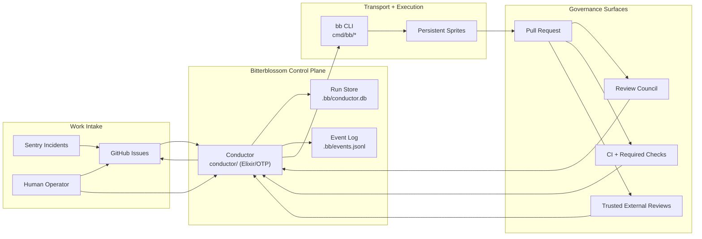
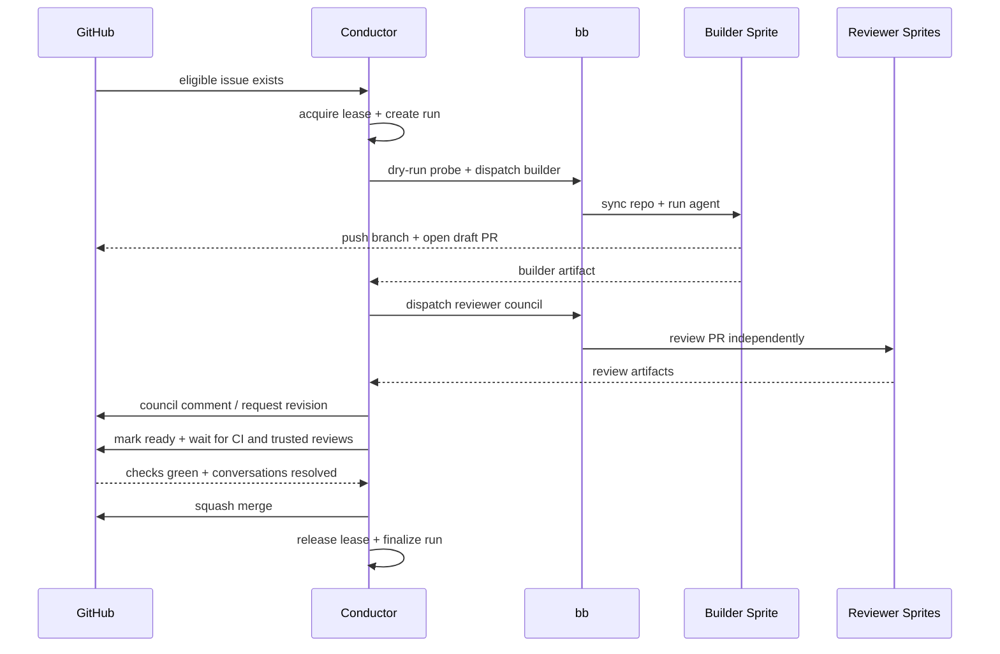

# Architecture

Bitterblossom has three surfaces:

- `conductor/`: Elixir/OTP orchestrator — the workflow brain (see [ADR-004](../adr/004-elixir-conductor-architecture.md))
- `cmd/bb`: thin Go transport — the operator and sprite edge
- `base/skills/`: skill files provisioned onto every sprite

This stack is intentionally small. The overview explains the full software-factory shape, then the drill-down docs cover each module.

## Map

- [System Overview](#system-overview)
- [Conductor](./conductor.md)
- [bb CLI Transport](./bb-cli.md)
- [Repo-Local Skills](./skills.md)
- [Architecture Glance](./glance.md)
- [Codebase Map](../CODEBASE_MAP.md)
- [Context Index](../context/INDEX.md)

## System Overview

## Trace Bullet

## Design Rules

- GitHub is the human-facing work ledger.
- SQLite + event log are the machine-facing truth.
- `bb` stays transport-sized; workflow judgment lives in the conductor.
- Sprites are persistent, but execution must trend toward isolated per-run work surfaces.
- Merge is a governance decision, not a builder feeling.

## Drill Down

### Control Plane

[Conductor](./conductor.md) covers:

- intake, leases, routing, review, CI, merge
- run-state transitions
- worker-readiness and auto-heal behavior
- where observability data is written

### Transport Edge

[bb CLI Transport](./bb-cli.md) covers:

- setup / dispatch / status / logs / kill responsibilities
- what `dispatch` actually does on-sprite
- how the conductor uses `bb` as a runtime adapter

### Skill System

[Repo-Local Skills](./skills.md) covers:

- skill inventory (bitterblossom-specific + vendored workflow + craft)
- how skills are provisioned via `bb setup`
- WORKFLOW.md required-skills contract
- responsibility boundary: advisory only, no workflow state
