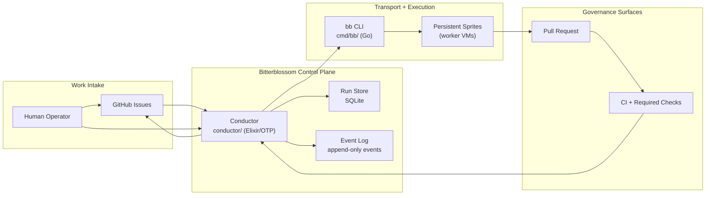
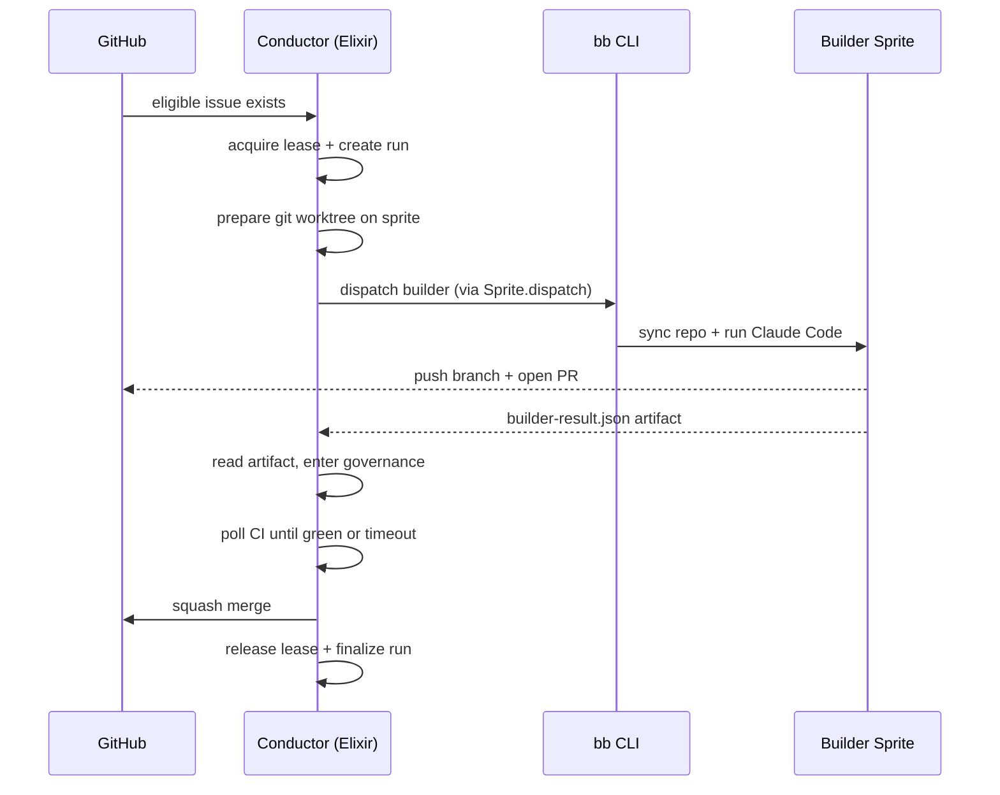

# Architecture

Bitterblossom has two core surfaces:

- `conductor/`: Elixir/OTP orchestrator — leases issues, dispatches builders, governs PRs, merges
- `cmd/bb/`: Go transport CLI (transitional — being absorbed into Elixir per #621)

This stack is intentionally small. The overview explains the full software-factory shape, then the drill-down docs explain each module.

## Map

- [System Overview](#system-overview)
- [Conductor (Elixir)](./conductor.md)
- [bb CLI Transport](./bb-cli.md)
- [Repo-local Skills](./skills.md)
- [Architecture Glance](./glance.md)
- [Codebase Map](../CODEBASE_MAP.md)
- [Context Index](../context/INDEX.md)

## System Overview

## Trace Bullet

## Design Rules

- GitHub is the human-facing work ledger.
- SQLite + event log are the machine-facing truth.
- `bb` stays transport-sized; workflow judgment lives in the conductor.
- Sprites are persistent VMs; execution uses isolated per-run git worktrees.
- Merge is a governance decision, not a builder feeling.

## Drill Down

### Control Plane

[Conductor](./conductor.md) covers:

- OTP supervision tree and GenServer lifecycle
- run-state machine (pending → building → governing → terminal)
- governance: CI polling, merge, block/fail paths
- persistence: SQLite runs + leases + events

### Transport Edge

[bb CLI Transport](./bb-cli.md) covers:

- setup / dispatch / status / logs / kill responsibilities
- what dispatch actually does on-sprite
- how the conductor uses `bb` as a runtime adapter
- transitional status (CLI surface shrinking as Elixir takes over)

### Repo-local Skills

[Skills](./skills.md) covers:

- first-party autonomy skills shipped onto sprites
- Bitterblossom-specific dispatch and monitoring skills
- provisioning contract and skill update path
