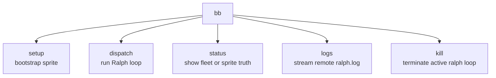
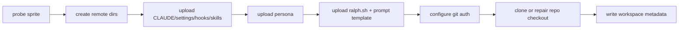
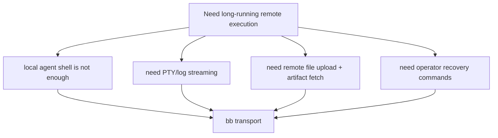
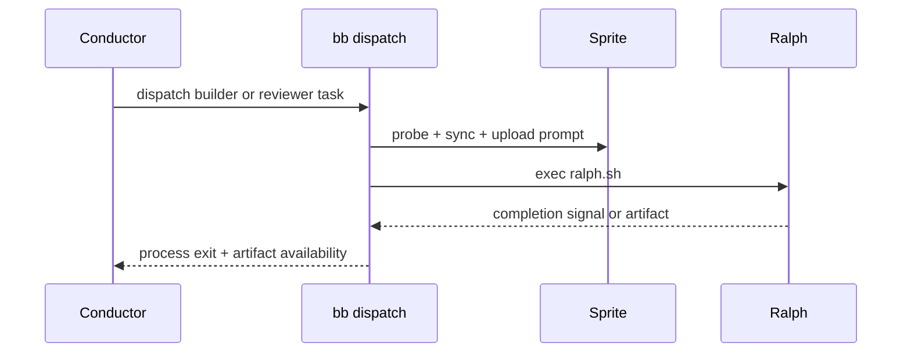

# bb CLI Transport

`bb` is the deterministic edge. It knows how to talk to sprites, bootstrap them, stream output, and report state. It should not become the workflow brain.

Files:

- [`cmd/bb/setup.go`](../../cmd/bb/setup.go)
- [`cmd/bb/dispatch.go`](../../cmd/bb/dispatch.go)
- [`cmd/bb/status.go`](../../cmd/bb/status.go)
- [`cmd/bb/logs.go`](../../cmd/bb/logs.go)
- [`cmd/bb/kill.go`](../../cmd/bb/kill.go)

## Command Map

## Dispatch Pipeline

```mermaid
flowchart LR
    Probe["probe sprite"] --> Config["verify setup"]
    Config --> Busy["check active ralph loop"]
    Busy --> Cleanup["kill stale agent processes"]
    Cleanup --> Sync["repo sync to default branch"]
    Sync --> Prompt["render + upload prompt"]
    Prompt --> Ralph["run ralph.sh"]
    Ralph --> Verify["verify work + PR state"]
    Verify --> Exit["exit code / optional CI wait"]
```

## Setup Pipeline

## Why This Layer Exists

## Relationship To The Conductor

The conductor calls `bb`; `bb` does not own the workflow.

## Responsibility Boundary

`bb` should keep:

- auth and connectivity
- repo sync
- prompt upload
- PTY execution
- log/status/reporting
- workspace metadata contracts

`bb` should avoid:

- issue prioritization
- review policy
- CI/merge governance
- semantic routing logic

That split is the reason Bitterblossom is still understandable.
