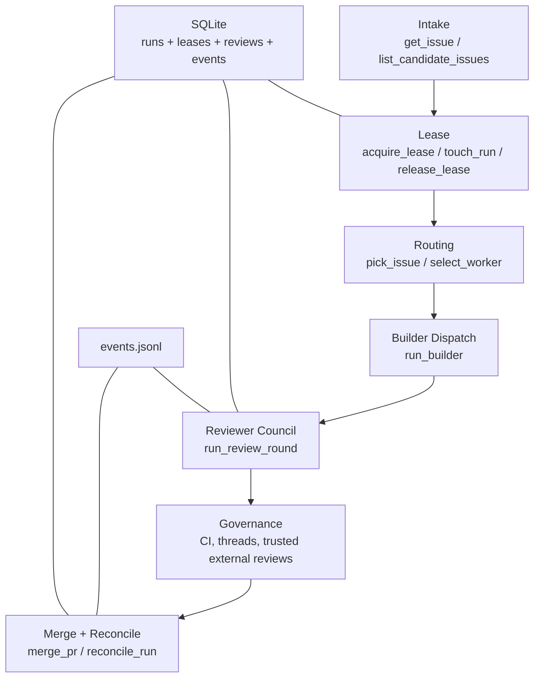
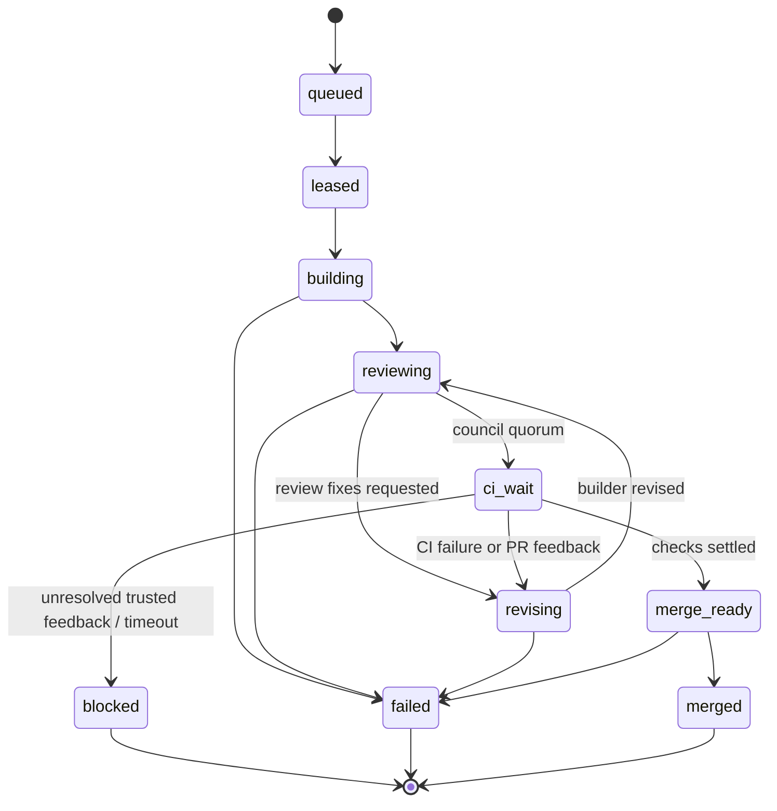
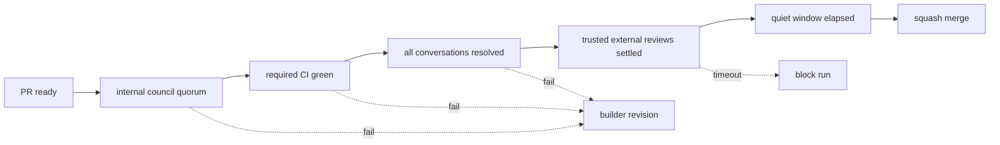
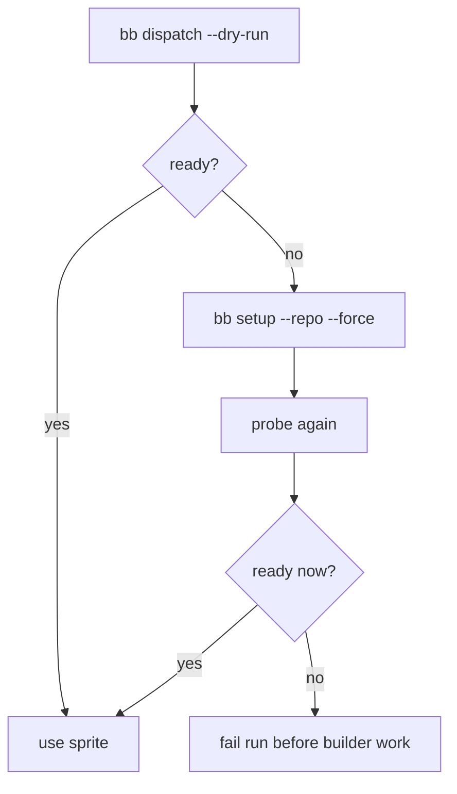

# Conductor

The conductor is the workflow brain. It decides when work starts, when it is blocked, when it needs revision, and when it is safe to merge.

File: [`scripts/conductor.py`](../../scripts/conductor.py)

## Module Shape

## Run State

## Governance Loop

## Worker Readiness

Recent failure mode: reviewer dispatch failed after the builder already opened a PR because a reviewer sprite had a broken repo checkout.

Current mitigation:

This is a point hardening step, not the final worker-pool design. The longer-term pool manager still belongs in the broader worker-health backlog.

## Persistent Truth

The conductor writes truth in two places:

- `.bb/conductor.db`
- `.bb/events.jsonl`

Use them for:

- current phase and status
- lease ownership and heartbeat expiry
- reviewer verdicts
- append-only event history

GitHub is still the operator-facing conversation surface, but the run store is where the machine remembers what actually happened.

## Key Interfaces

### Intake

- `get_issue(...)`
- `list_candidate_issues(...)`
- `pick_issue(...)`

### State

- `open_db(...)`
- `create_run(...)`
- `update_run(...)`
- `record_event(...)`
- `touch_run(...)`

### Runtime

- `select_worker(...)`
- `run_builder(...)`
- `run_review_round(...)`

### Governance

- `wait_for_pr_checks(...)`
- `list_unresolved_review_threads(...)`
- `wait_for_external_reviews(...)`
- `merge_pr(...)`

## What This Module Should Not Become

- not a second `bb`
- not a generic fleet manager
- not a bag of shell heuristics with implied state
- not a peer-to-peer sprite chat layer

It should stay deep: small operator surface, rich internal orchestration.
