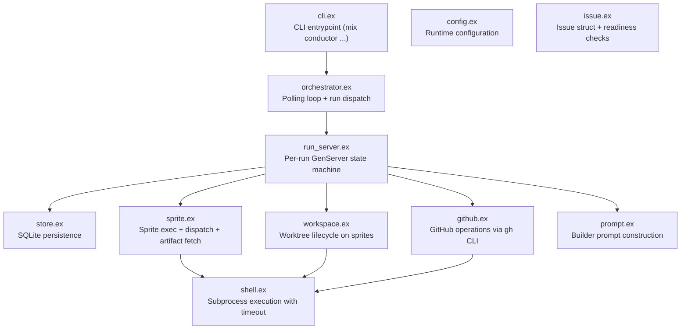
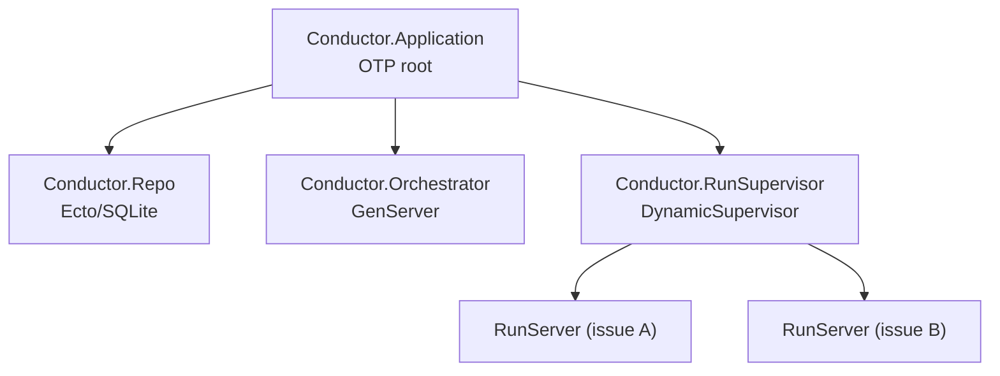
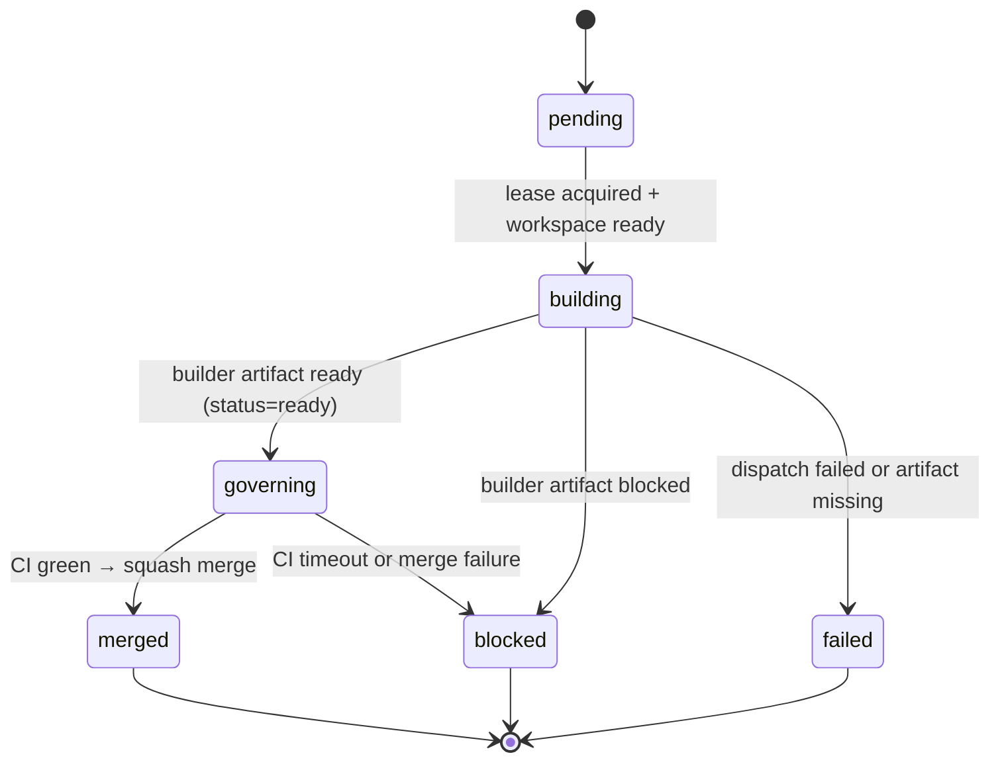
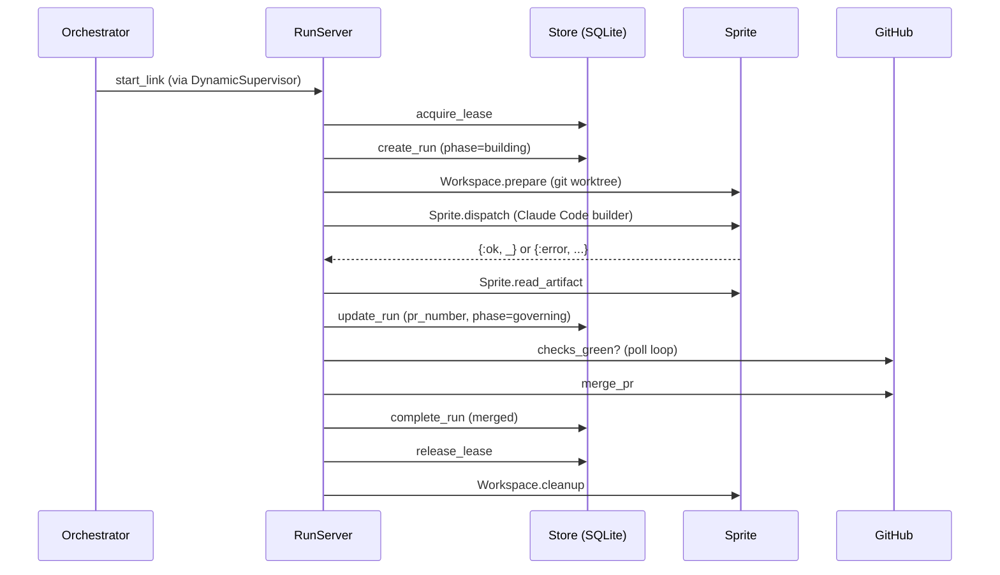

# Conductor

The conductor is the workflow brain. It decides when work starts, when it is blocked, and when it is safe to merge. Built as an Elixir/OTP application.

Source: [`conductor/lib/conductor/`](../../conductor/lib/conductor/)

## Module Map

## Supervision Tree

Each issue gets its own `RunServer` under `RunSupervisor`. Restarts are `:temporary` (no automatic retry — failure is a terminal state).

## Run State Machine

## Trace Bullet (RunServer lifecycle)

## Key Interfaces

### Orchestrator

- `run_once(opts)` — run a single issue synchronously
- `start_loop(opts)` — start continuous polling loop
- `pick_worker/1` — round-robin worker selection

### Store

- `acquire_lease/3`, `release_lease/2` — exclusive run ownership
- `create_run/1`, `update_run/2`, `complete_run/3` — run lifecycle
- `record_event/3` — append-only event log
- `heartbeat_run/1` — keepalive for stale-run detection

### GitHub

- `get_issue/2`, `eligible_issues/2` — intake
- `checks_green?/2` — CI polling
- `merge_pr/2` — squash merge

### Sprite

- `dispatch/4` — run Claude Code on a sprite with prompt + repo
- `exec/3` — raw command execution with timeout
- `read_artifact/2` — fetch builder-result.json from sprite

## Persistence

Two durable truth surfaces:

| Surface | Location | Contents |
|---------|----------|----------|
| SQLite | `.bb/conductor.db` (on conductor host) | runs, leases, events |
| Event log | same DB events table | append-only audit trail |

GitHub remains the human conversation surface. SQLite is what the machine remembers.

## What This Module Should Not Become

- not a second transport CLI (that is `bb`'s job)
- not a generic fleet manager
- not a bag of shell heuristics with implied state
- not a peer-to-peer sprite chat layer

Stay deep: small operator surface, rich internal orchestration.
