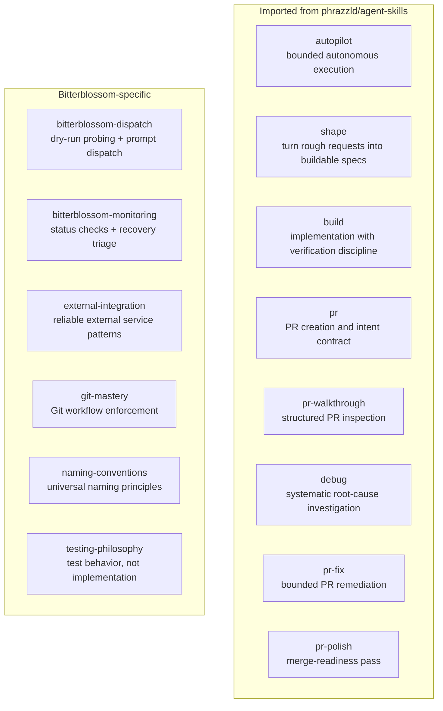
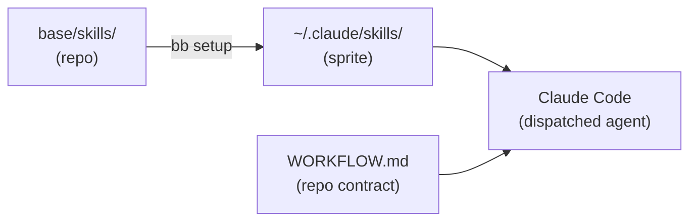

# Repo-local Skills

Skills are runtime guidance files shipped onto sprites. They are not a transport API — they are imported instructions that agents use when executing within a phase.

Source: [`base/skills/`](../../base/skills/)

## Two Layers

## Provisioning Contract

`bb setup` copies the full `base/skills/` tree onto every managed sprite. Skills are version-pinned by the Bitterblossom repo state — no per-sprite drift.

`WORKFLOW.md` is the authority. Skills execute inside that contract; they do not replace it.

## Skill Structure

Each skill directory contains:

| File | Purpose |
|------|---------|
| `SKILL.md` | Manifest and runbook — the agent reads this |
| `glance.md` | Short local summary for fast retrieval |
| `references/` | Supporting material that travels with the skill |

## Phase → Skill Mapping

| Phase | Primary Skills |
|-------|---------------|
| shape | `shape`, `autopilot` |
| build | `build`, `pr` |
| review | `pr-walkthrough`, `debug` |
| fix | `pr-fix`, `pr-polish` |
| merge | `pr`, `autopilot` |
| recover | `debug`, `autopilot` |
| dispatch (operator) | `bitterblossom-dispatch` |
| monitor (operator) | `bitterblossom-monitoring` |

## Update Path

1. Edit skill files in `base/skills/` (repo)
2. Commit to a feature branch, open a PR, merge after review and CI pass
3. Run `bb setup <sprite> --repo <repo>` to re-provision
4. New dispatches pick up the updated skill content

No service restart needed — skills are plain text files read at agent startup.

## What Skills Are Not

- not a second conductor protocol
- not the source of truth for live CLI flags (see `docs/CLI-REFERENCE.md`)
- not executable binaries — they are guidance text
- not a replacement for `WORKFLOW.md` — they execute inside it
