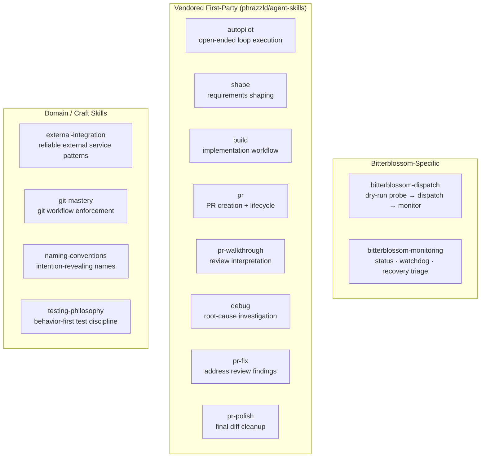
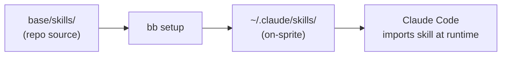

# Repo-Local Skills

Skills are structured guidance files loaded by Claude Code at prompt time. They replace long inline instructions with versioned, swappable knowledge modules.

## What a Skill Is

A skill is a Markdown file with a YAML frontmatter header. Claude Code imports it into the agent context before execution.

```text
base/skills/<skill-name>/
  SKILL.md    frontmatter + guidance body
```

Frontmatter fields:

```yaml
name: <skill-name>
user-invocable: true | false
description: "one-liner for selection UI"
allowed-tools:
  - Read
  - Bash
  ...
```

## Skill Inventory



### Bitterblossom-specific skills

| Skill | Purpose |
|---|---|
| `bitterblossom-dispatch` | Probe readiness, plan a dry-run, dispatch a task, and tail logs. User-invocable. |
| `bitterblossom-monitoring` | Monitor a live dispatch, handle a stuck sprite, run targeted recovery. User-invocable. |

### Phase workflow skills (vendored)

| Skill | Phase | Purpose |
|---|---|---|
| `shape` | Shape | Turn raw issues into buildable specs |
| `build` | Build | Implement with TDD and narrow scope |
| `pr` | Build/Merge | Create and manage pull requests |
| `pr-walkthrough` | Review | Semantic review interpretation |
| `debug` | Review/Recover | Root-cause investigation |
| `pr-fix` | Fix | Address active blocking findings |
| `pr-polish` | Fix | Final diff cleanup before merge |
| `autopilot` | All | Open-ended autonomous execution loop |

### Craft skills (vendored)

Applied within other workflow phases, not tied to a single phase:

- `external-integration` — env validation, health checks, error observability
- `git-mastery` — atomic commits, conventional format, branch strategy
- `naming-conventions` — intention-revealing names, avoid Manager/Helper/Util
- `testing-philosophy` — behavior not implementation, AAA structure, minimal mocks

## How Skills Are Provisioned



`bb setup` uploads the entire `base/skills/` tree to every managed sprite. Skills are version-pinned to the repo state at setup time. To update a sprite's skills, re-run `bb setup`.

## WORKFLOW.md Required Skills

The `WORKFLOW.md` frontmatter declares the minimum skill set each phase requires:

```yaml
required_skills:
  - shape
  - build
  - pr
  - pr-walkthrough
  - debug
  - pr-fix
  - pr-polish
  - autopilot
```

These skills must be present on any worker dispatched for that phase.

## Adding or Updating a Skill

1. Edit or create `base/skills/<name>/SKILL.md`
2. Re-provision managed sprites: `bb setup <sprite> --repo <owner/repo> --force`
3. Update this doc if the skill inventory changes

## Responsibility Boundary

Skills should stay **advisory**. They explain how to do things; they do not make workflow decisions. Workflow state, lease authority, and merge governance live in the conductor, not in skills.
