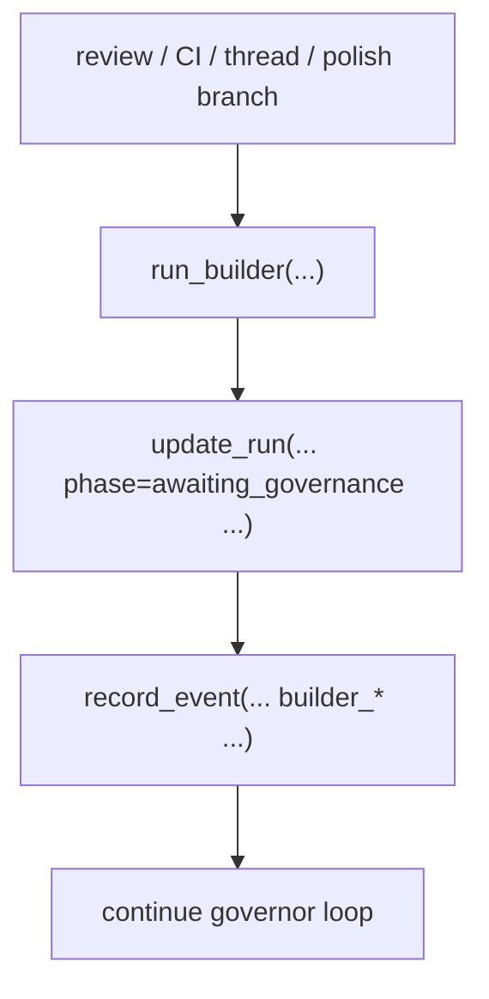
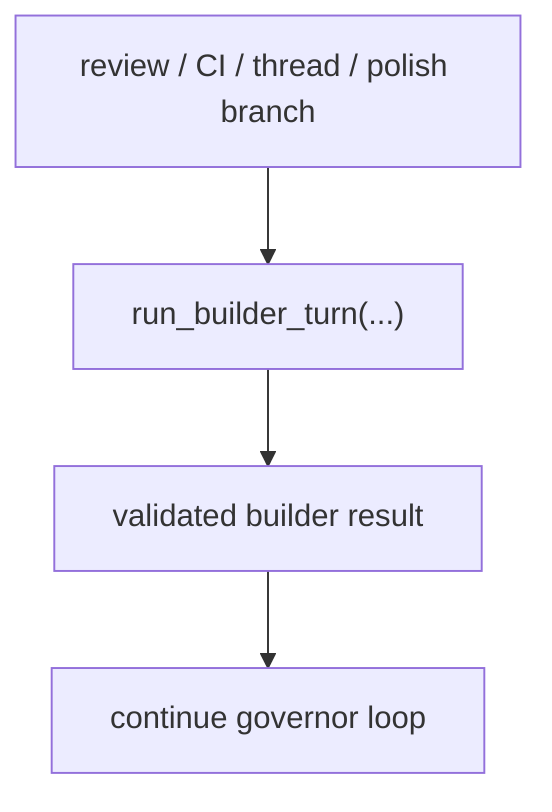

# Builder Turn Handoff Walkthrough

## Claim

This refactor makes "successful builder turn" a real conductor boundary instead of a repeated call-site ritual.

## Renderer

- Diagram-led walkthrough with terminal verification

## Why Now

The governor loop is the most change-prone part of the control plane. Before this branch, every place that reran the builder also had to remember the same handoff bookkeeping. That was cheap to copy once and expensive to keep correct forever.

## Before



The same sequence appeared in multiple branches inside `govern_pr_flow(...)` plus the initial handoff in `run_once(...)`.

## After



## State Invariant

```mermaid
stateDiagram-v2
    [*] --> revising
    revising --> "run_builder_turn(...)"
    "run_builder_turn(...)" --> awaiting_governance
    awaiting_governance --> governing
```

Successful builder work now publishes one invariant in one place:

- refresh branch / PR metadata on the run row
- restore `phase="awaiting_governance"`
- emit the matching builder event

## Evidence Mapping

- Boundary implementation:
  `scripts/conductor.py`
- Governor call-site simplification:
  `scripts/conductor.py`
- Regression proof:
  `scripts/test_conductor.py::test_run_builder_turn_records_governance_handoff`

## Verification

```bash
pytest -q scripts/test_conductor.py
pytest -q scripts/test_conductor.py -k 'run_once or govern_pr'
```

## Residual Risk

This branch centralizes successful handoff behavior only. Error handling and broader conductor modularization are still separate follow-up candidates.
