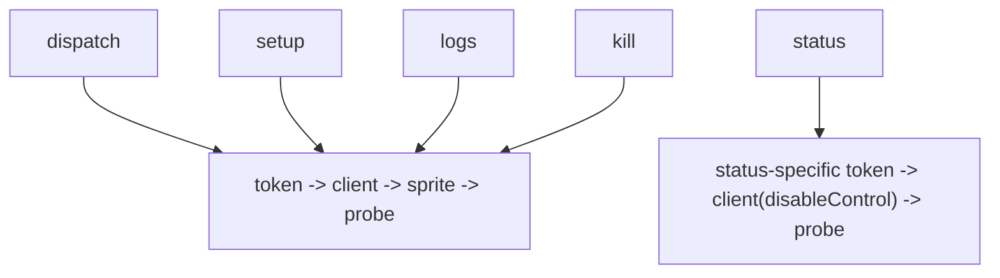
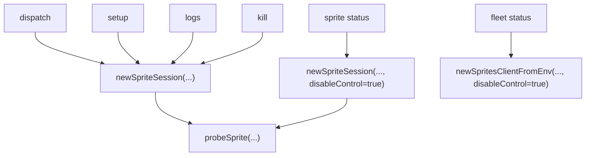
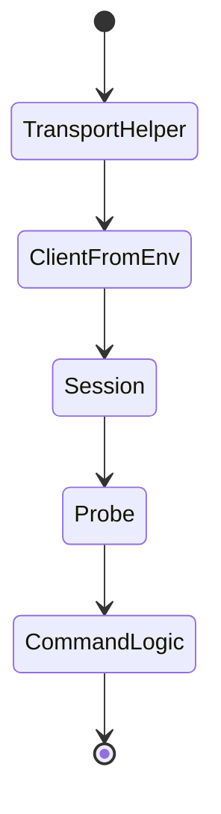

# Walkthrough: Simplify bb Sprite Transport

## Title

Collapse repeated sprite client, probe, and session setup into one transport module.

## Why Now

ADR-002 says `bb` should stay thin and deterministic. Before this branch, five commands each reimplemented the same transport ceremony: read sprite auth, build a client, select a sprite, probe reachability, and only then do command-specific work. That made the boundary shallow. A transport tweak such as probe policy or client options required touching several command files instead of one module.

## Before

- Command files owned transport setup and command behavior at the same time.
- `status` carried a slightly different client path, so transport policy was split across the package.
- A routine transport change required editing multiple files before any command-specific logic changed.

## What Changed

- `cmd/bb/sprite_transport.go` now owns sprite-token lookup, client construction, session creation, and reachability probes.
- The command files keep their flags, scripts, and remote behavior, but they stop carrying transport boilerplate.
- `status` still uses `disableControl`, but that transport choice now lives in the helper contract instead of a separate ad hoc client path.

## After

Observable improvements:

- transport setup now has one home instead of five call-site copies
- the command files each lost more setup than they gained
- future transport changes such as probe timeout policy or client options can land in one module
- command behavior is preserved because the refactor stops at the setup seam, not the command scripts

## Verification

Primary walkthrough artifact:

- [`codex-simplify-bb-sprite-transport-terminal.txt`](./codex-simplify-bb-sprite-transport-terminal.txt)

Persistent protecting check:

- `go test ./cmd/bb/...`

Supporting check:

- `go build -o bin/bb ./cmd/bb`

Code-shape proof captured in the terminal artifact:

- every command now routes through `newSpriteSession(...)` or `newSpritesClientFromEnv(...)`
- `spriteToken()` now has one transport call site outside `main.go`

## Residual Risk

- This simplifies transport setup, not the larger `dispatch.go` script-check surface.
- The helper still returns concrete `sprites-go` types; deeper test seams for transport failures would be a separate follow-up.
- The walkthrough proves compile and package-test safety locally. It does not prove real sprite network behavior without PR CI or a live sprite exercise.

## Merge Case

This branch makes `bb` closer to the design the repo already claims to want: command files describe command behavior, while one helper owns the mechanical transport path. The gain is not new capability. The gain is a deeper module boundary that reduces how many files future transport changes have to touch.
