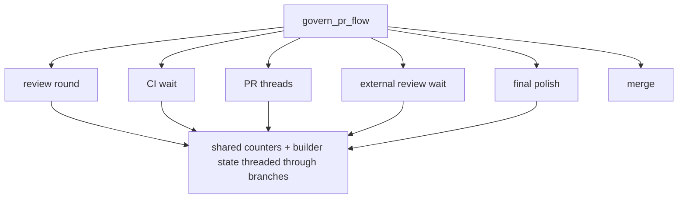
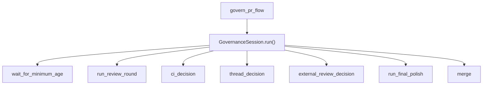
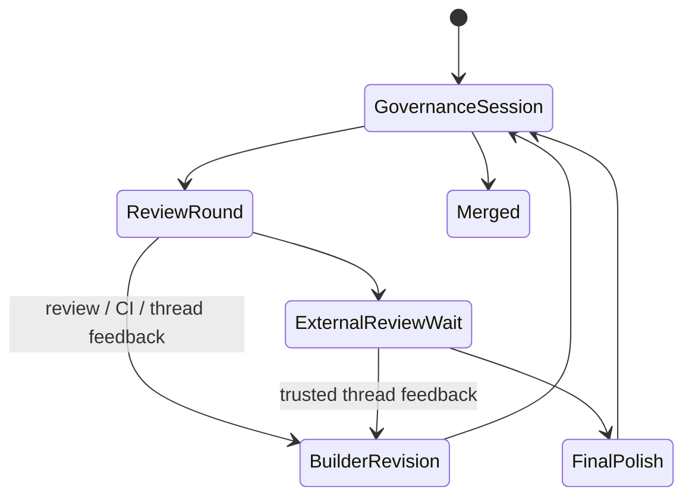

# Walkthrough: Simplify Governance Session

## Title

Collapse `govern_pr_flow` into a state-owning `GovernanceSession`.

## Why Now

Before this branch, the conductor's governor lane lived in one 426-line temporal script. It mixed review policy, CI policy, PR-thread policy, external-review waiting, final polish, and merge handoff in one function, so even a small governance tweak required threading the same mutable state through several branches.

## Before

- The policy was correct, but the module boundary was shallow.
- Repeated builder-turn requests and PR-thread handling made the control flow harder to audit.
- `govern_pr_flow` needed to know too much about its own bookkeeping state.

## What Changed

- `GovernanceSession` now owns the mutable governor state: builder handoff, revision counters, last PR-thread ids, and polish state.
- The repeated "request another builder turn" path is centralized behind one session method instead of being reassembled at each branch.
- `govern_pr_flow` becomes the entry wrapper and the session becomes the deep module.

## After

Observable improvements:

- the governor lane now hides its bookkeeping state behind one boundary
- revision requests follow one internal path instead of five hand-built call sites
- tests still exercise the same operator-visible run contract

## Verification

Primary walkthrough artifact:

- [`codex-simplify-governance-session-terminal.txt`](./codex-simplify-governance-session-terminal.txt)

Persistent protecting check:

- `python3 -m pytest -q scripts/test_conductor.py`

Supporting checks:

- `python3 -m ruff check scripts/conductor.py scripts/test_conductor.py`
- AST shape check captured in the transcript:
  - base branch `govern_pr_flow`: `426` lines
  - this branch `govern_pr_flow`: `27` lines
  - this branch `GovernanceSession`: `445` lines

## Residual Risk

- This is still one large conductor module; the simplification is inside the governor seam, not a full conductor split.
- The session object reduces parameter-threading, but future work could still extract shared run-lifecycle policy from `run_once` and `govern_pr`.

## Merge Case

This branch keeps the conductor's behavior and tests intact while making the core governance path easier to change safely. The important shift is not "fewer lines overall"; it is that the governor's internal state is now owned in one place instead of being spread across a long procedural script.
