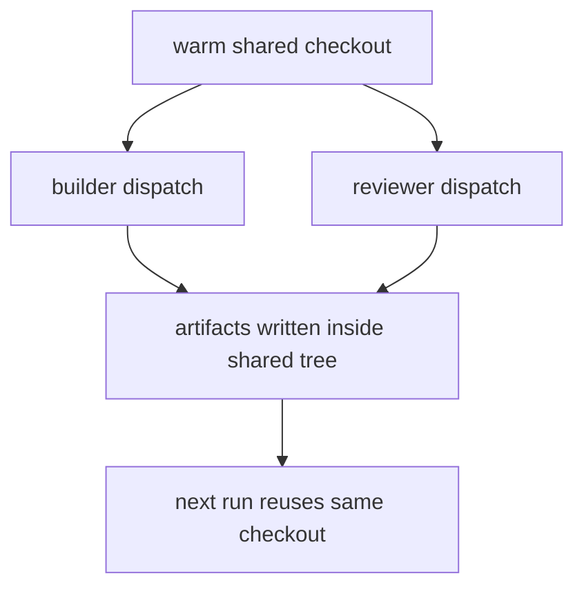
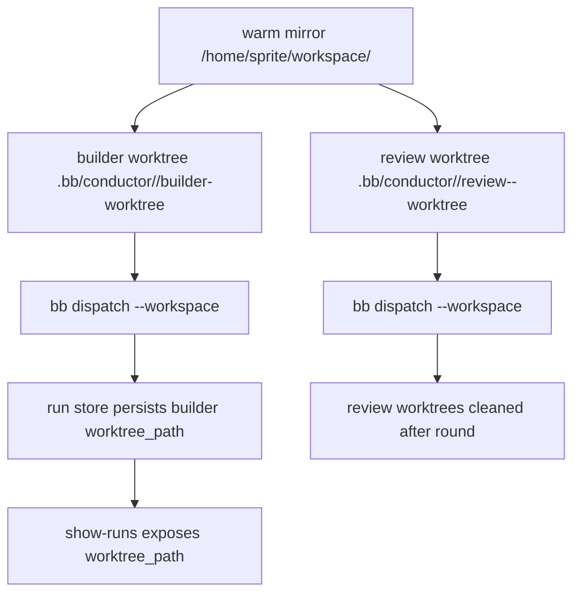
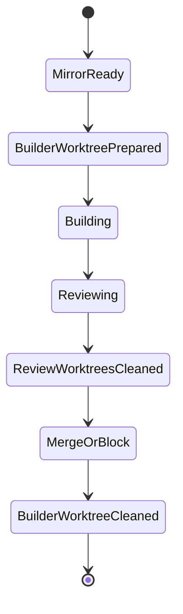

# Walkthrough: Issue 469

## Title

Isolate conductor builder and reviewer runs with per-run Git worktrees while preserving the warm repo mirror.

## Why Now

Before this branch, the conductor dispatched builders and reviewers into the shared checkout at `/home/sprite/workspace/<repo>`. That violated ADR-003's isolation rule, let untracked files leak across runs, and made cleanup dependent on a dirty shared tree staying healthy.

## Before

- Conductor artifact paths were run-scoped, but the execution surface was not.
- `bb dispatch` always synced and ran inside `/home/sprite/workspace/<repo>`.
- `show-runs` could not tell an operator which worktree a run used because no worktree path was persisted.

## What Changed

- `scripts/conductor.py` now prepares and removes run-scoped worktrees off the warm mirror.
- `cmd/bb/dispatch.go` accepts `--workspace` so the conductor can dispatch into an already-prepared worktree without re-syncing the shared checkout.
- The run ledger now stores `worktree_path`, and the operator docs explain how to inspect it with `show-runs`.

## After

Observable improvements:

- consecutive runs no longer share the same mutable execution directory
- reviewer workspaces are isolated from the builder and from each other
- the coordinator has durable metadata showing which builder worktree belonged to a run

## Verification

Primary protecting checks:

- `python3 -m pytest -q scripts/test_conductor.py`
- `go test ./...`

Evidence covered by those checks:

- conductor dispatch plumbing accepts and propagates workspace overrides
- builder run state records `worktree_path`
- `show-runs` surfaces `worktree_path`
- worktree helper paths and cleanup behavior are exercised in regression tests

## Residual Risk

- The walkthrough proves the control-plane contract and local test coverage, not a live sprite integration run against a real remote worker.
- `worktree_path` is currently persisted for the builder lane; reviewer paths are intentionally ephemeral and only visible through events/logs.

## Merge Case

This branch closes the largest remaining isolation gap in the conductor MVP without adding a second sync mechanism or abandoning warm mirrors. It makes run state more truthful, cleanup more deterministic, and the worker filesystem contract inspectable by operators.
