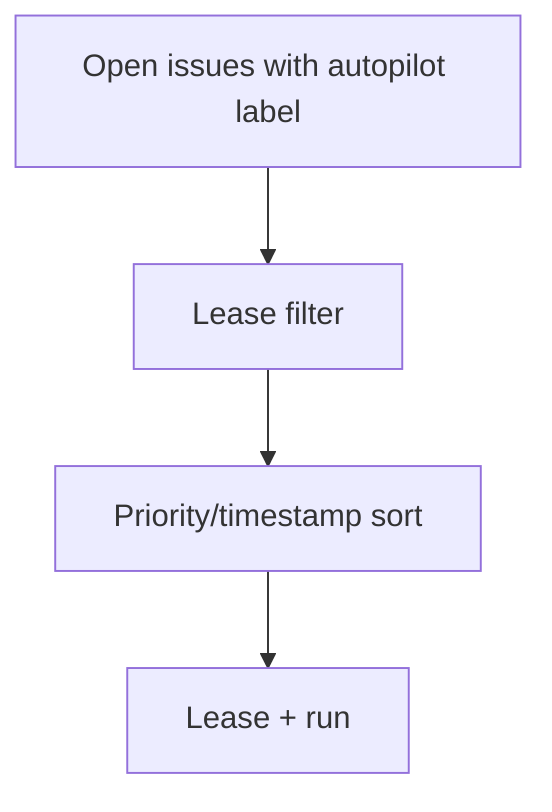
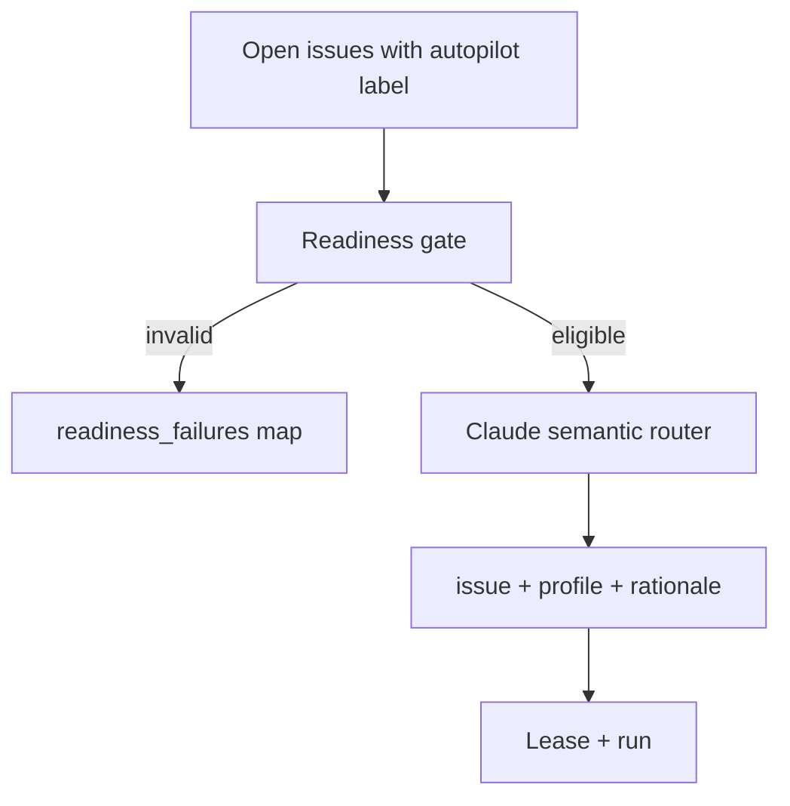

# Walkthrough: Issue 474 Semantic Routing

## Claim

The conductor now rejects malformed autopilot issues before leasing them and uses a Claude-backed routing step to choose the next eligible issue/profile pair with a machine-readable explanation.

## Before

- Backlog pickup filtered leases deterministically, then sorted issues by labels and timestamps.
- Malformed issues were indistinguishable from merely lower-priority issues during auto-pick.
- Operators had no command that exposed why one issue/profile pair was selected.



## After

- The conductor validates a minimal autopilot-ready contract on every candidate issue.
- Invalid issues stay visible through `readiness_failures` instead of being silently ignored.
- Eligible issues go through a Claude structured-output routing step that returns the chosen issue, profile, and rationale.



## Live Proof

Command:

```bash
python3 scripts/conductor.py route-issue --repo misty-step/bitterblossom --label autopilot --limit 25
```

Observed result on this branch:

- Selected issue: `#474`
- Profile: `claude-sonnet`
- Rationale: the router preferred the conductor's own routing/readiness work because it improves every later backlog pickup.
- Readiness failures: current backlog issues without `## Product Spec` / `### Intent Contract` were returned explicitly instead of being silently ranked.

## Verification

Persistent checks:

```bash
python3 -m pytest -q scripts/test_conductor.py
python3 scripts/conductor.py route-issue --repo misty-step/bitterblossom --label autopilot --limit 25
```
