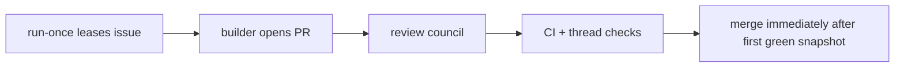
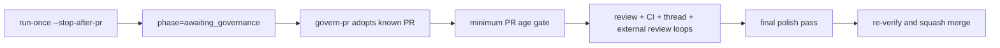
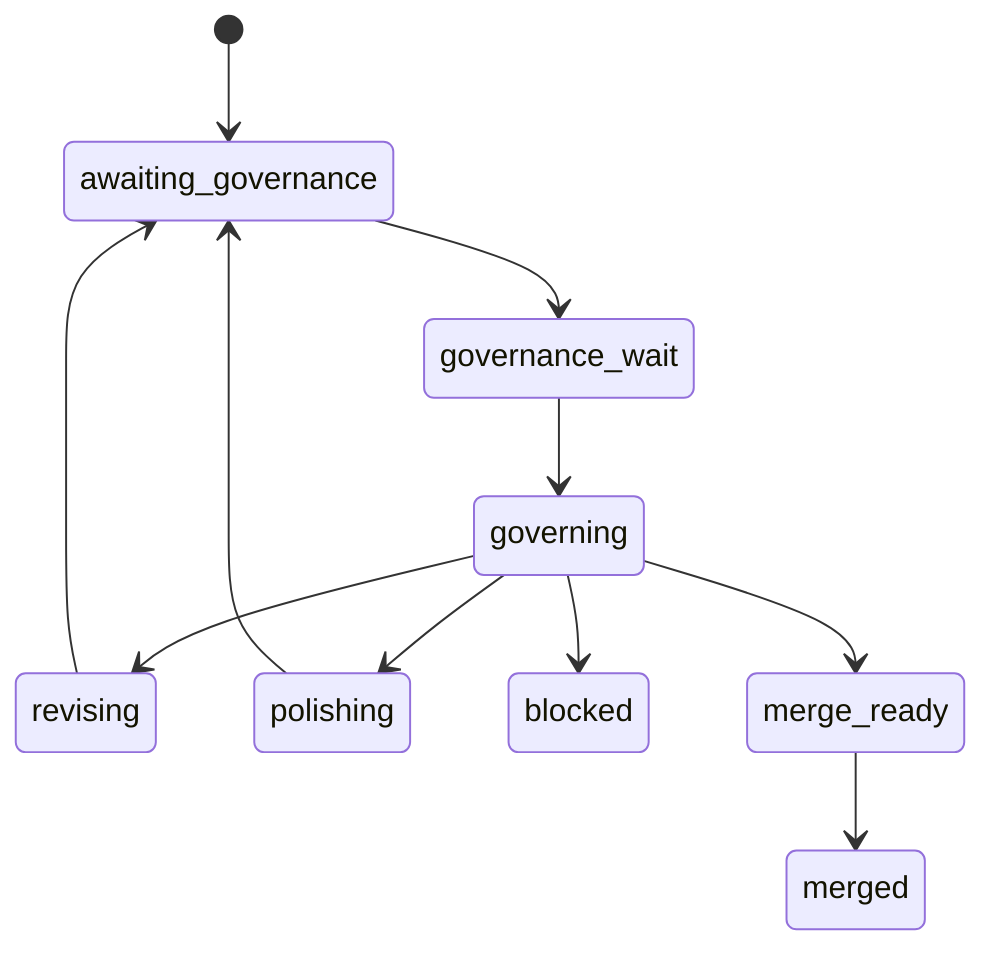

# Issue 479 Walkthrough: Builder Handoff and Governor Lane

## Claim

Issue [#479](https://github.com/misty-step/bitterblossom/issues/479) required Bitterblossom to stop treating "PR opened" and "safe to merge" as the same phase. This change introduces an explicit builder handoff state, a `govern-pr` adoption command for known PRs, a minimum-age freshness gate, and a final polish pass before squash merge.

## Before



The same `run-once` path owned PR creation, late-review handling, and merge. A builder handoff existed in practice, but the run store did not expose a stable governor boundary and the conductor could still merge too quickly once the first snapshot looked green.

## After



## State Shape



## Why This Is Better

- Builder delivery is now a durable handoff, not an implied mid-function state.
- Governance can adopt an existing PR explicitly with `govern-pr` instead of requiring a fresh issue run.
- Merge now waits on both time freshness and review freshness, then proves one last simplification pass before landing.

## Verification

```bash
python3 -m pytest -q scripts/test_conductor.py
python3 scripts/conductor.py run-once --help
python3 scripts/conductor.py govern-pr --help
```

Persistent verification:

- `scripts/test_conductor.py`
  - builder handoff mode via `--stop-after-pr`
  - governor adoption via `govern-pr`
  - PR minimum-age wait behavior
  - late review thread rechecks before and after external review settlement
  - final polish pass before merge
