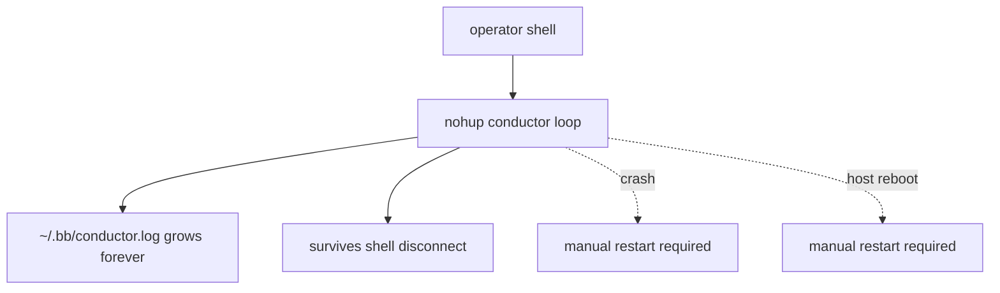
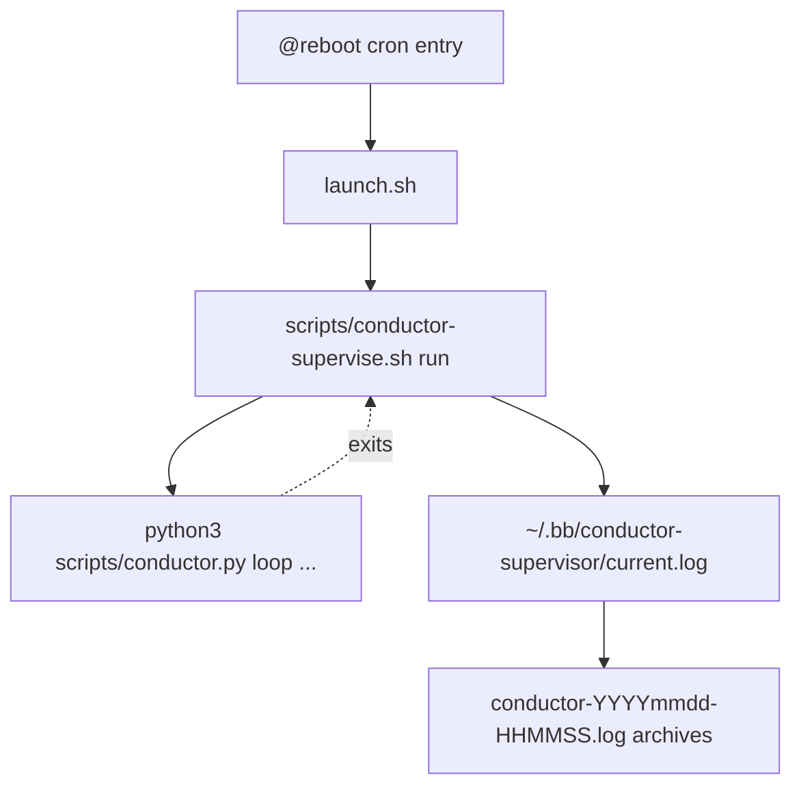
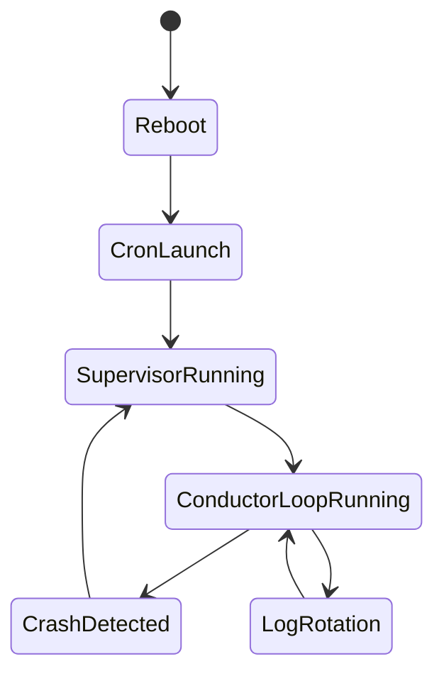

# Walkthrough: Issue 482

## Title

Add a supported coordinator supervisor contract with crash restart, reboot bootstrap, and bounded local logs.

## Why Now

Before this branch, the conductor docs recommended `nohup python3 scripts/conductor.py loop ...`. That was enough to survive an SSH disconnect, but it did not define what should happen after a process crash, a coordinator reboot, or long-lived log growth.

## Before

- Disconnect durability existed, but crash durability did not.
- Reboot recovery depended on an operator coming back to a shell.
- Log location existed, but the retention policy was unbounded.

## What Changed

- `scripts/conductor-supervise.sh` now provides one repo-owned supervisor for the coordinator lane.
- `install-cron` writes a stable reboot launcher so coordinator restart does not depend on a human reopening a shell.
- `rotate-logs` and the runtime log writer keep local logs bounded by size and archive count.
- `docs/CONDUCTOR.md` now documents the supported contract, validation commands, sleep assumptions, and recovery flow.
- `Makefile` exposes explicit operator entrypoints for start, reboot-hook install, status, and stop.

## After

Observable improvements:

- crash recovery is automatic under one supported repo contract
- reboot recovery is explicit and testable through the installed launcher
- log storage is bounded and inspectable under one stable directory

## Verification

Primary protecting checks:

- `make lint-python`
- `make test-python`
- `python3 scripts/conductor.py check-env`
- `python3 scripts/conductor.py show-runs --limit 5`

Evidence covered by those checks:

- cron installation writes the reboot launcher expected by the docs
- log rotation archives and prunes old files instead of growing forever
- the documented environment validation path succeeds once `bin/bb` is built
- operator run inspection remains available through `show-runs`

## Residual Risk

- The walkthrough proves the repo contract and local regression coverage, not a live reboot on a real coordinator sprite.
- The reboot bootstrap depends on per-user cron being available on the coordinator host image.

## Merge Case

This branch replaces an under-specified `nohup` story with one explicit supervisor contract that remains lightweight. Operators now have a documented way to start the coordinator, verify that reboot recovery is installed, inspect bounded logs, and restart the lane without inventing their own daemon pattern.
