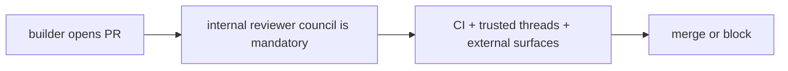
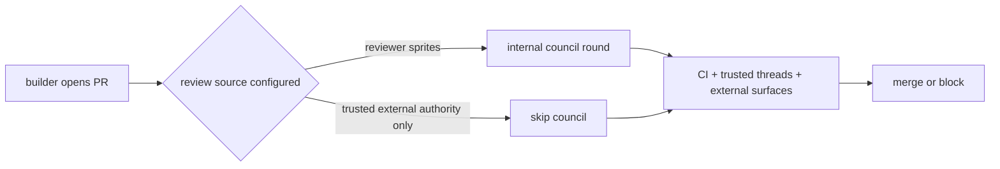
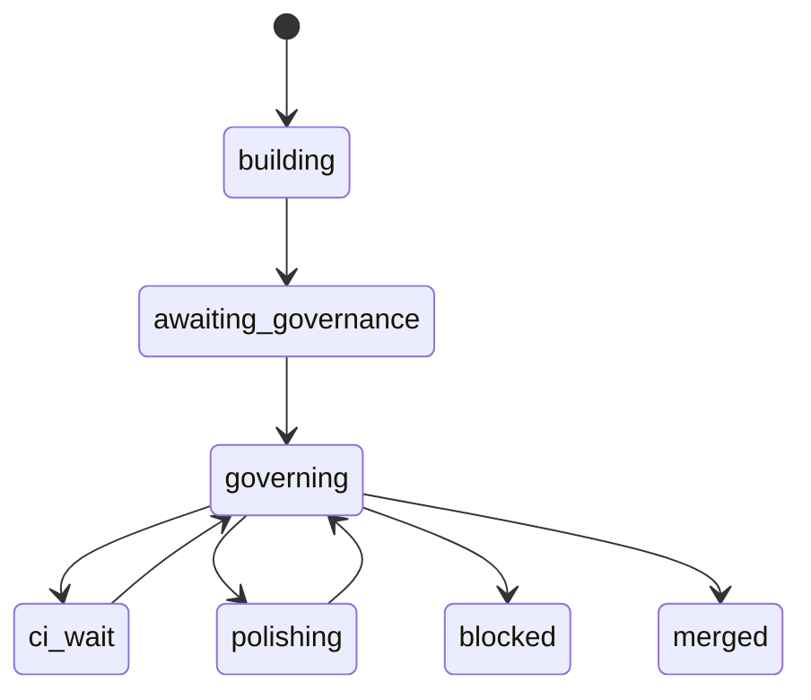

# Issue 494 Walkthrough: External Review Authority Without Reviewer Sprites

## Claim

Issue [#494](https://github.com/misty-step/bitterblossom/issues/494) required the conductor to treat trusted external review surfaces as a first-class governance source instead of always forcing an internal reviewer council first. This change keeps the existing council path intact, but allows `run-once` and `govern-pr` to operate with external authority alone.

## Before



Even when Cerberus or another trusted surface was configured, the conductor still required `--reviewer` sprites and an internal quorum before governance could move forward.

## After



## Control Flow



The only branch change is at the start of governance: if reviewer sprites are configured, the council still runs; if only trusted external surfaces are configured, governance skips directly to CI, trusted-thread handling, and external-review settlement.

## Runtime Proof

Focused regression slice from this branch:

```text
$ python3 -m pytest -q scripts/test_conductor.py -k 'external_authority_without_internal_reviewers or ensure_review_source_configured or parse_args_allows_external_authority_without_reviewers or govern_pr_uses_external_authority_without_internal_reviewers'
....                                                                     [100%]
4 passed, 227 deselected in 0.36s
```

Full conductor suite from this branch:

```text
$ python3 -m pytest -q scripts/test_conductor.py
231 passed in 9.13s
```

CLI help now exposes the intended contract on both commands:

```text
$ python3 scripts/conductor.py run-once --help | rg -n "reviewer|trusted-external-surface"
27:  --reviewer REVIEWER   Reviewer sprite. Required unless --trusted-external-
44:  --trusted-external-surface TRUSTED_EXTERNAL_SURFACES
```

```text
$ python3 scripts/conductor.py govern-pr --help | rg -n "reviewer|trusted-external-surface"
27:  --reviewer REVIEWER   Reviewer sprite. Required unless --trusted-external-
44:  --trusted-external-surface TRUSTED_EXTERNAL_SURFACES
```

## Why This Is Better

- External authority is now a real governance mode instead of an additive wait after a mandatory council.
- The conductor still errors clearly if neither reviewer sprites nor trusted external surfaces are configured.
- Existing council-backed behavior is preserved because the internal review path is unchanged when reviewers are present.

## Persistent Verification

- `scripts/test_conductor.py`
  - `test_parse_args_allows_external_authority_without_reviewers`
  - `test_ensure_review_source_configured_requires_council_or_external_authority`
  - `test_run_once_uses_external_authority_without_internal_reviewers`
  - `test_govern_pr_uses_external_authority_without_internal_reviewers`
- Full regression gate: `python3 -m pytest -q scripts/test_conductor.py`
