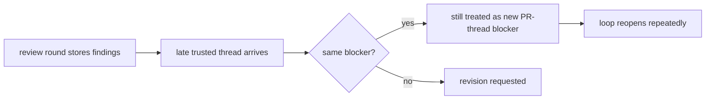
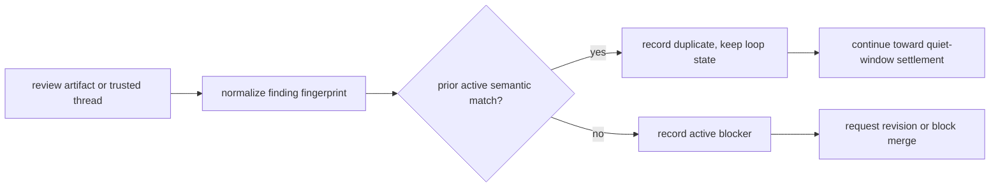
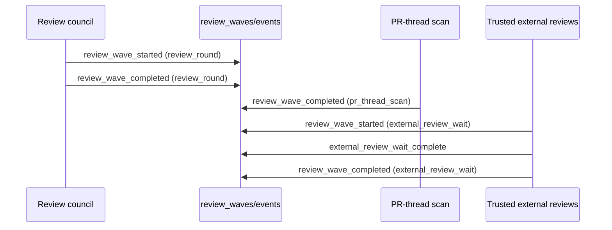

# Issue 500 Walkthrough: Bounded Review Governance

## Claim

Issue [#500](https://github.com/misty-step/bitterblossom/issues/500) required Bitterblossom to treat duplicate review noise as one semantic blocker and to make convergence visible in operator surfaces. This change collapses duplicate findings across reviewers, review waves, and trusted PR-thread scans, while also emitting explicit review-wave events for settlement waits.

## Before



The conductor only collapsed duplicate fingerprints for PR-thread findings against earlier PR-thread findings. The same blocker could be restated by a different reviewer or surface and still reopen governance. Quiet-window settlement also only appeared as a generic wait completion event instead of a first-class review-wave step.

## After



## Event Shape



## Why This Is Better

- Duplicate blockers now collapse semantically across review surfaces instead of reopening the run on every restatement.
- A trusted PR thread that merely repeats an already-recorded blocker no longer restarts the full revision loop after settlement.
- `show-events` now exposes review-wave start/finish and trusted external-review settlement directly, so operators can inspect convergence without reconstructing it from incidental events.

## Verification

```bash
python3 -m pytest -q scripts/test_conductor.py
python3 -m pytest -q scripts/test_conductor.py -k 'duplicate_fingerprint or low_severity_nit or novel_high_severity or trusted_thread'
```

Persistent verification:

- `scripts/test_conductor.py`
  - duplicate finding collapse across reviewers and review waves
  - trusted PR-thread dedupe against review artifacts
  - stale unresolved-thread blocking after revision
  - operator-visible review-wave events in `show-events`
