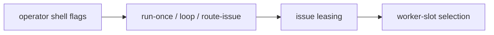
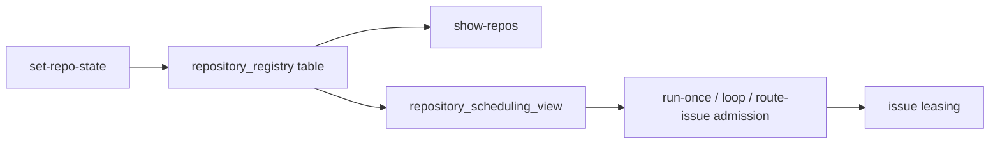

# Issue 503 Walkthrough: Repository Registry

## Claim

The conductor now persists repo-level scheduling state in SQLite, exposes it via
machine-readable operator commands, and blocks new work for paused, draining, or
saturated repositories before lease acquisition.

## Before



- Repo participation lived in transient CLI arguments.
- The kernel could not answer whether a repo was paused or draining.
- Desired concurrency was visible only on worker-oriented surfaces.

## After



- Repo scheduling state is durable kernel-owned data.
- Operators can inspect repo state, utilization, and remaining capacity from one JSON surface.
- New work is rejected before lease acquisition when the repo is paused, draining, or already at desired concurrency.

## Verification

```bash
python3 -m pytest -q scripts/test_conductor.py -k "repository or show_repos or unschedulable or scheduling_is_blocked"
python3 -m pytest -q scripts/test_conductor.py
```

Expected:

- repo-registry helper and command tests pass
- the full conductor suite stays green after the new admission gate

## Key Files

- `scripts/conductor.py`
- `scripts/test_conductor.py`
- `docs/CONDUCTOR.md`

