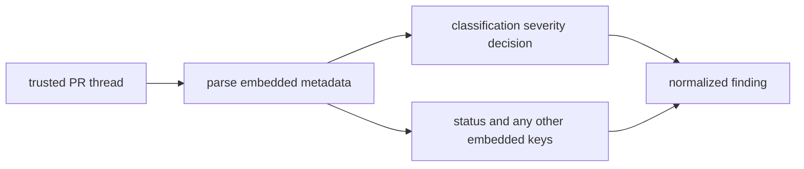
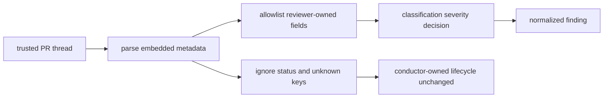
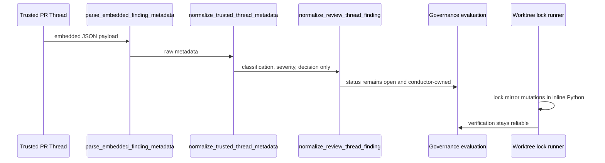

# Walkthrough: Issue 529 Trusted PR-Thread Metadata Contract

## Claim

Issue [#529](https://github.com/misty-step/bitterblossom/issues/529) required the conductor to make the trusted PR-thread metadata contract explicit. This branch now accepts only reviewer-owned semantic fields from trusted thread metadata, keeps lifecycle state conductor-owned, documents that boundary, and preserves the adjacent worktree lock gate that protects conductor verification on macOS.

## Before



Trusted thread normalization only implicitly ignored internal fields. Reviewers had no documented contract stating which embedded keys were allowed to influence governance, and the lock-based worktree cleanup proof could fail locally because the mirror lock remained held after prepare.

## After



## Architecture / Runtime Change



## Why This Is Better

- The trusted-thread contract is now codified in one named allowlist instead of being scattered across implicit field reads.
- Docs and tests now agree on the exact reviewer-owned surface: `classification`, `severity`, and `decision`.
- The adjacent worktree lock proof is reliable again because Git subprocesses no longer inherit the shared mirror lock descriptor during local verification.

## Reviewer Evidence

- Start here: [Terminal transcript](./issue-529-trusted-thread-metadata-terminal.txt)
- Fast claim: the transcript shows the branch-specific diff summary, the focused metadata slice, the repaired worktree lock slice, `ruff`, and the full conductor suite all passing from this branch.

## Verification

Persistent checks:

```bash
python3 -m pytest -q scripts/test_conductor.py -k "trusted or metadata or pr_review_thread"
python3 -m pytest -q scripts/test_conductor.py -k "prepare_run_workspace_waits_for_lock_release or cleanup_run_workspace_waits_for_lock_release or cleanup_run_workspace_reports_lock_timeout"
python3 -m ruff check scripts/conductor.py scripts/test_conductor.py
python3 -m pytest -q scripts/test_conductor.py
```
