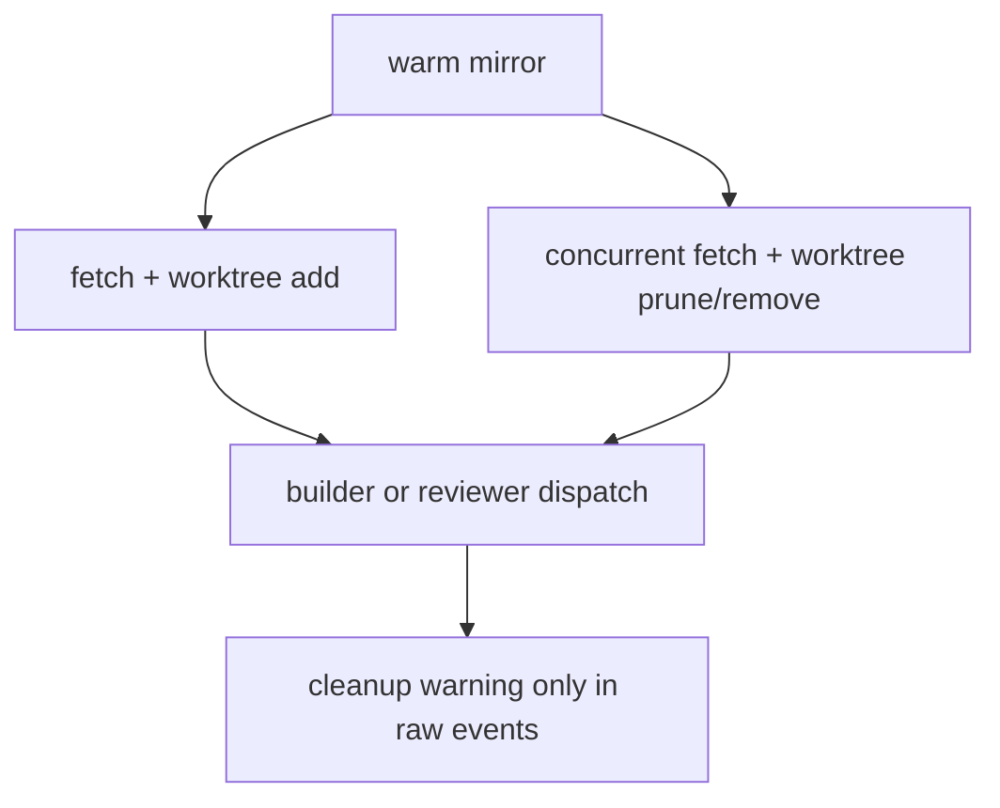
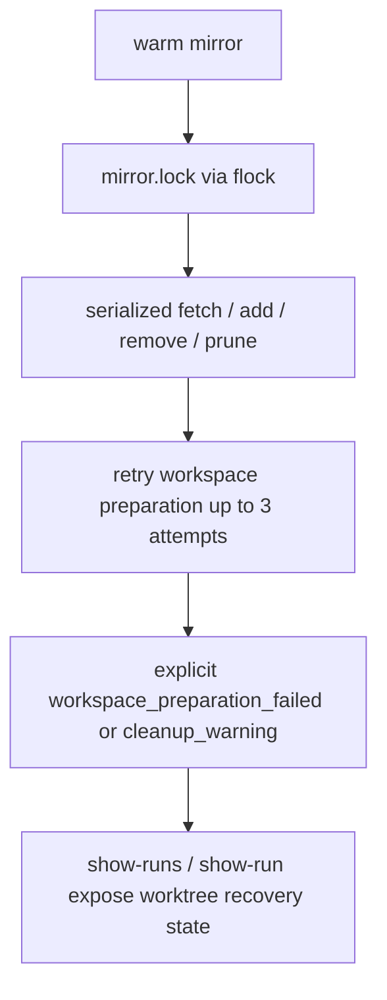
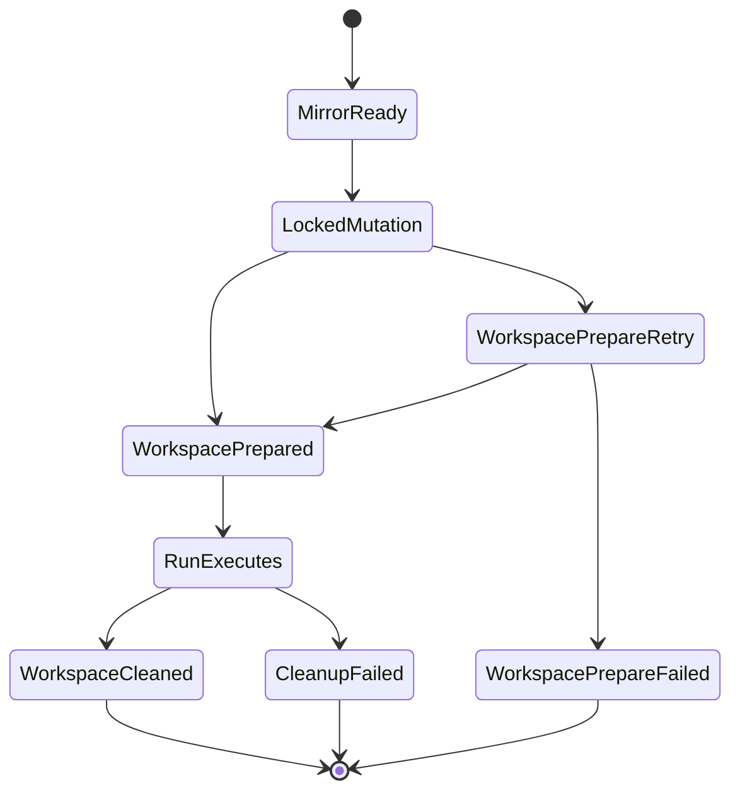

# Walkthrough: Issue 538

## Title

Harden conductor worktree preparation and cleanup under overlap and transient failure without abandoning the warm mirror model.

## Why Now

Issue #469 established run-scoped worktrees, but the lifecycle still had three weak spots:

- mirror mutation could race across overlapping runs on one sprite
- workspace preparation was single-shot, so transient sprite/git failures looked like generic command failures
- cleanup degradation only lived in event logs, which made `show-runs` and `show-run` incomplete as recovery surfaces

## Before

- `prepare_run_workspace` mutated the warm mirror with no cross-run lock.
- any workspace preparation failure surfaced as a generic `command_failed`
- `show-runs` exposed `worktree_path`, but not whether cleanup or preparation had degraded

## What Changed

- `scripts/conductor.py` now serializes mirror mutation on-sprite with `.bb/conductor/mirror.lock`
- builder and reviewer workspace preparation now retries bounded transient failures before failing with `workspace_preparation_failed`
- run inspection surfaces now expose `worktree_recovery_status`, `worktree_recovery_error`, and the event that established that state
- workspace cleanup warnings now persist the surviving worktree path in explicit recovery context

## After

Observable improvements:

- overlapping worktree operations no longer race on one sprite
- transient workspace preparation failures either recover cleanly or fail with an explicit workspace-preparation reason
- operators can inspect cleanup degradation directly from `show-runs` / `show-run` without dropping to the worker filesystem

## Verification

Primary protecting checks:

- `python3 -m pytest -q scripts/test_conductor.py`
- `python3 -m pytest -q scripts/test_conductor.py -k "worktree or workspace or cleanup"`
- `python3 -m ruff check scripts/conductor.py scripts/test_conductor.py`
- `go test ./...`

Evidence covered by those checks:

- lock-based serialization is present in the workspace shell contract
- transient workspace preparation retries are recorded and recover correctly
- repeated preparation failure emits `workspace_preparation_failed`
- `show-runs` / `show-run` surface cleanup and preparation recovery context

## Residual Risk

- the lock relies on `flock` being available in the sprite image; that matches current Linux sprite assumptions but is not separately probed here
- the retry policy is intentionally narrow and mechanical: three attempts with a fixed delay, not an adaptive backoff controller

## Merge Case

This branch keeps the current warm-mirror architecture intact while making its failure modes legible and safer under concurrency. It improves correctness and operator trust with one deeper lifecycle contract instead of introducing another workspace mechanism.
