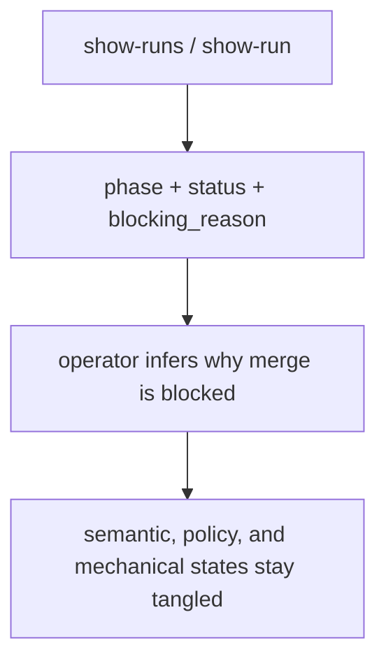
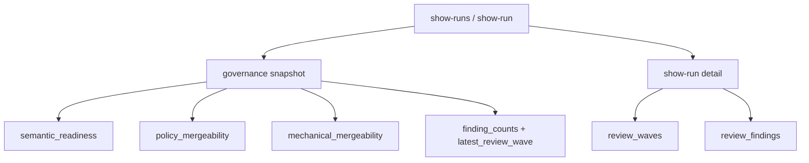
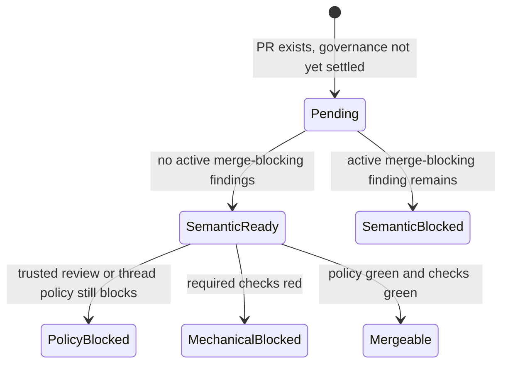

# Issue 593 Walkthrough: Governance Truth on Run Surfaces

## Claim

Issue [#593](https://github.com/misty-step/bitterblossom/issues/593) asks Bitterblossom to stop collapsing semantic readiness, policy mergeability, and mechanical mergeability into one vague blocked state. This branch adds an explicit governance snapshot to the run surfaces so operators can inspect those truths separately without replaying the raw event log by hand.

## Before



Before this change, the run surfaces exposed useful blocking context, but not the actual governance model. A run with clean review findings and a red `merge-gate` check still looked generically blocked unless the operator manually stitched together review findings, review waves, and CI events.

## After



## State Change



## Why This Is Better

- The run surface now tells the truth about which layer is blocking merge.
- `show-runs` becomes useful for triage instead of just surfacing that something is blocked.
- `show-run` exposes normalized findings and review waves directly, so review convergence can be audited without reconstructing it from incidental events.

## Verification

```bash
python3 -m pytest -q scripts/test_conductor.py
python3 -m ruff check scripts/conductor.py scripts/test_conductor.py
```

Persistent verification:

- `test_show_runs_include_governance_summary`
- `test_show_run_separates_semantic_policy_and_mechanical_mergeability`
- `test_show_run_surfaces_governance_findings_and_review_waves`
