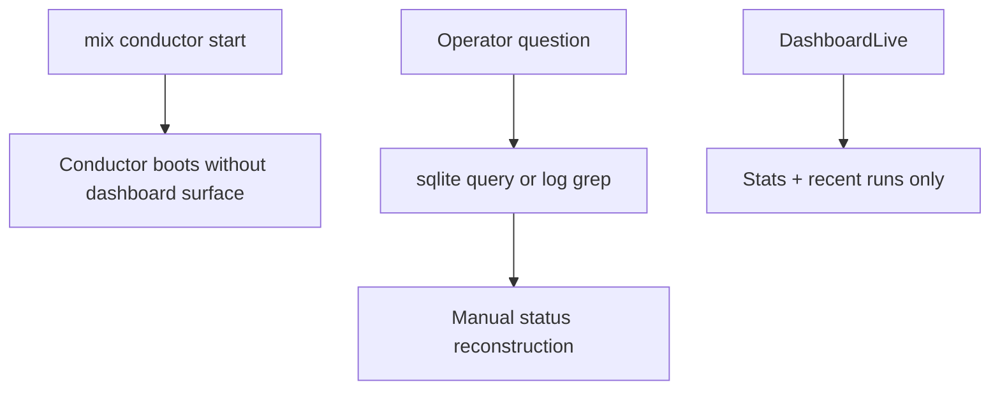
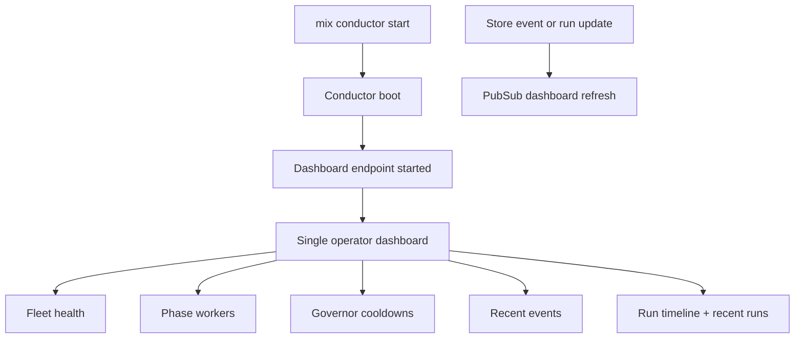

# Walkthrough: Issue 779 Dashboard Operator Visibility

## Claim

The conductor dashboard now exposes the operator surfaces that were previously hidden behind shell access: fleet health, phase worker state, governor cooldowns, recent event flow, historical run outcomes, and the recent run table on one page.

## Before

- `DashboardLive` rendered only top-line run counters and a recent run table.
- Store events did not broadcast dashboard refreshes, so event-oriented visibility depended on polling.
- `HealthMonitor`, `Fixer`, and `Polisher` status APIs did not expose enough metadata for a truthful operator panel.
- The dashboard endpoint was not started by the main `mix conductor start` path.



## After

- `mix conductor start` starts the dashboard endpoint through the CLI boot path.
- `DashboardLive` renders one operator page with fleet, workers, governor, events, timeline, and recent runs.
- Store event writes broadcast to the dashboard topic, so event stream updates arrive without waiting for the poll fallback.
- Health and worker status APIs now surface role, last activity, poll interval, and failure metadata needed for truthful visibility.



## Live Proof

Open the dashboard after booting the conductor:

```bash
cd conductor
mix conductor start --fleet ../fleet.toml
```

Observed on this branch:

- the dashboard endpoint is started from the `mix conductor start` lane rather than a separate manual command
- the page renders dedicated sections for fleet health, phase workers, governor cooldowns, recent events, run timeline, and recent runs
- dashboard event rows refresh on store event broadcasts without waiting for the 30-second fallback poll

## Verification

Persistent checks:

```bash
cd conductor
mix compile --warnings-as-errors
mix test test/conductor/dashboard_live_test.exs test/conductor/fleet/health_monitor_test.exs test/conductor/fixer_test.exs test/conductor/polisher_test.exs
mix test
```
